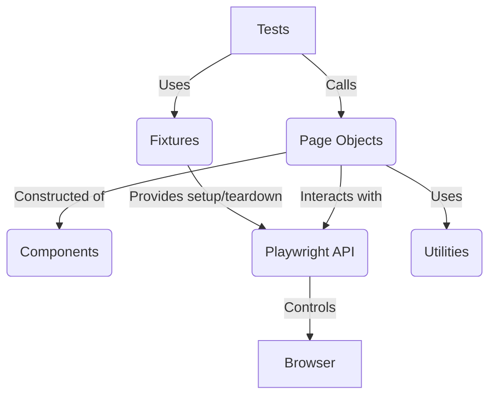
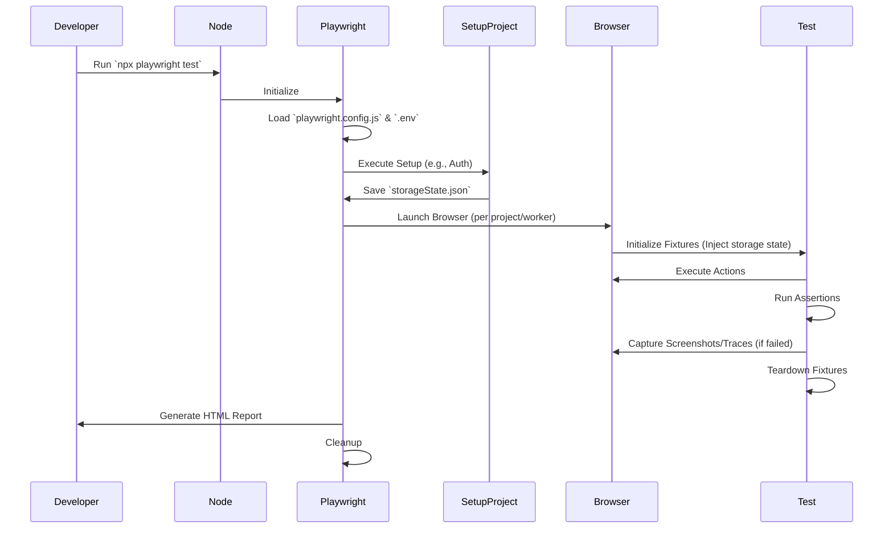
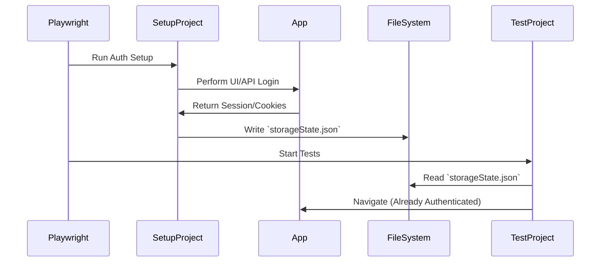
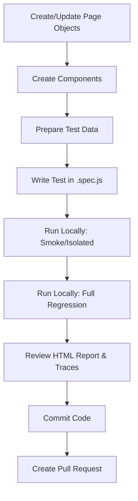

# Playwright Automation Framework Architecture

## 1. Framework Overview

The primary purpose of this automation framework is to provide a robust, scalable, and maintainable structure for end-to-end (E2E) UI and API testing using Playwright. 

### Design Principles
- **Scalability**: Designed to easily accommodate an increasing number of tests, projects, and environments without degrading performance or maintainability.
- **Maintainability**: Adheres to clean code practices, centralized configurations, and modular design.
- **Reusability**: Emphasizes reusable components, utility functions, and fixtures to minimize code duplication.
- **Separation of Concerns**: Strict boundary definition between test logic, page interactions, data management, and configuration.

### Why the Page Object Model (POM)?
The framework strictly adheres to the Page Object Model pattern. POM abstracts the web page interface into classes, reducing code duplication and improving test maintenance. When the UI changes, locators and actions only need to be updated in one place (the Page Object) rather than across multiple test files.

---

## 2. Framework Architecture

The framework relies on a layered architecture to ensure separation of concerns.



**Layer Responsibilities:**
- **Tests**: Contain assertions and test logic. They describe *what* is being tested.
- **Fixtures**: Handle environment setup, dependency injection, state management, and teardown, ensuring tests run in isolation.
- **Page Objects**: Encapsulate the locators and actions for specific pages. They describe *how* to interact with the UI.
- **Components**: Reusable UI fragments (e.g., Headers, Footers, Modals) shared across multiple Page Objects.
- **Utilities**: Helper functions (e.g., random data generation, logging, date manipulation).
- **Playwright API**: The core automation library driving the browser.

---

## 3. Project Structure

```text
project-root/
├── components/
├── config/
├── fixtures/
├── pages/
├── reports/
├── screenshots/
├── test-data/
├── tests/
│   ├── setup/
│   ├── smoke/
│   ├── regression/
│   └── e2e/
├── utils/
├── playwright.config.js
├── package.json
├── .env
└── README.md
```

---

## 4. Folder Documentation

### `components/`
- **Purpose**: Store reusable UI component classes.
- **Responsibilities**: Encapsulate locators and actions for UI fragments that appear on multiple pages (e.g., Navigation Bar, Cookie Consent Modal).
- **Files inside**: `Navbar.js`, `Sidebar.js`, `CookieBanner.js`.
- **Relationships**: Imported and instantiated within Page Objects.
- **Developer guidelines**: 
  - **Do's**: Keep components independent. Make them highly reusable.
  - **Don'ts**: Do not add test assertions in components. Do not navigate to full pages from within a component.
- **Example implementation**: A `Header` component that encapsulates the search bar and profile dropdown.
- **Common mistakes**: Duplicating component logic directly inside Page Objects instead of referencing the component class.

### `pages/`
- **Purpose**: Store Page Object classes representing full web pages.
- **Responsibilities**: Define locators and action methods for full pages.
- **Files inside**: `LoginPage.js`, `DashboardPage.js`, `BasePage.js`.
- **Relationships**: Used directly by Tests. Often inherits from `BasePage.js`.
- **Developer guidelines**:
  - **Do's**: Return other Page Objects from actions that trigger navigation (e.g., `login()` returns `DashboardPage`).
  - **Don'ts**: Do not write complex validation logic or assertions here.
- **Example implementation**: A `LoginPage` class with `fillUsername()`, `fillPassword()`, and `clickSubmit()` methods.
- **Common mistakes**: Hardcoding test data directly into the Page Object instead of passing it as parameters.

### `fixtures/`
- **Purpose**: Store Playwright custom fixtures.
- **Responsibilities**: Provide isolated environments, reusable test data, and initialized Page Objects to tests via dependency injection.
- **Files inside**: `baseFixture.js`, `authFixture.js`.
- **Relationships**: Imported by Tests in place of standard Playwright `@playwright/test`.
- **Developer guidelines**:
  - **Do's**: Use fixtures to abstract repetitive setup and teardown logic.
- **Example implementation**: A fixture that automatically instantiates all Page Objects so tests can just accept `({ loginPage, dashboardPage })`.
- **Common mistakes**: Overcomplicating fixtures with business logic rather than keeping them focused on setup.

### `tests/`
- **Purpose**: Store actual test specification files (`*.spec.js`).
- **Responsibilities**: Execute test steps and validate outcomes using assertions.
- **Files inside**: Organized into subfolders like `smoke/`, `regression/`, `e2e/`, and `setup/`.
- **Relationships**: Imports Fixtures and Test Data. Interacts with Page Objects via Fixtures.
- **Developer guidelines**:
  - **Do's**: Keep tests concise and independent. Use descriptive names.
- **Example implementation**: `login.spec.js` asserting successful login and redirection.
- **Common mistakes**: Writing tests that depend on the successful execution of a previous test.

### `utils/`
- **Purpose**: Store helper functions.
- **Responsibilities**: Provide common functionality not tied to specific pages or tests.
- **Files inside**: `logger.js`, `randomData.js`, `apiHelper.js`.
- **Relationships**: Used anywhere in the framework (Tests, Page Objects, etc.).
- **Developer guidelines**:
  - **Do's**: Keep utilities pure and stateless where possible.
- **Example implementation**: `generateRandomEmail()` to provide unique identifiers for user registration tests.
- **Common mistakes**: Creating utilities for built-in Playwright features (e.g., creating a custom click utility instead of using `locator.click()`).

### `config/`
- **Purpose**: Store environment-specific configurations and constants.
- **Responsibilities**: Manage URLs, user credentials, and environment flags outside of source code.
- **Files inside**: `env.config.js`, `constants.js`.
- **Relationships**: Referenced globally.
- **Example implementation**: Mapping `process.env.ENV` to specific base URLs.

### `reports/`
- **Purpose**: Store execution artifacts (HTML reports).
- **Responsibilities**: House generated test results for analysis.
- **Developer guidelines**: **Don't** commit these to source control.

### `screenshots/`
- **Purpose**: Store visual artifacts.
- **Responsibilities**: House screenshots taken on failure or for visual regression testing.
- **Developer guidelines**: **Don't** commit dynamic failure screenshots to source control.

### `test-data/`
- **Purpose**: Store static test data.
- **Responsibilities**: Provide JSON or CSV files containing mock data, user profiles, or expected results.
- **Files inside**: `users.json`, `products.json`.
- **Relationships**: Imported directly into tests.
- **Common mistakes**: Putting sensitive PII or real production data in these files.

---

## 5. Important Configuration Files

### `playwright.config.js`
The central configuration file for Playwright.
- **`projects`**: Defines execution environments (e.g., Desktop Chrome, Mobile Safari). Allows matrix testing across multiple browsers.
- **`dependencies`**: Specifies project dependencies (e.g., E2E tests depend on the Setup project for authentication).
- **`retries`**: Number of times to retry failed tests (typically 0 locally for fast feedback, 1-2 in CI to mitigate flakiness).
- **`timeout`**: Maximum time one test can run before being forcefully terminated.
- **`reporter`**: Defines output formats (e.g., `html`, `list`, `junit` for CI integration).
- **`workers`**: Number of concurrent test runners. Usually set to 1 locally and higher in CI.
- **`baseURL`**: The root URL used for relative navigation (e.g., `page.goto('/dashboard')` resolves to `https://example.com/dashboard`).
- **`storageState`**: Path to save/load browser context state (cookies, local storage) for session reuse, preventing repetitive logins.
- **`trace`**: Configuration for trace generation. Best practice is `'retain-on-failure'` to save disk space while aiding debugging.
- **`screenshot`**: When to capture screenshots (e.g., `'only-on-failure'`).
- **`video`**: When to capture execution video (e.g., `'retain-on-failure'`).
- **`use`**: Global options applied to all contexts (e.g., headless mode, viewport size).
- **`testDir`**: The directory where tests are located.
- **`outputDir`**: The directory where test artifacts (traces, videos) are saved.

### `package.json`
- **Scripts**: Shortcut commands for execution (e.g., `"test:smoke": "playwright test --grep @smoke"`).
- **Dependencies**: Core libraries required for execution (rare for purely E2E repos).
- **DevDependencies**: Tools needed for development (Playwright, ESLint, Prettier, Faker.js).
- **Version management**: Ensures consistent execution environments across the team by locking package versions.
- **Custom commands**: Used to simplify complex CLI arguments for the team.

### `.env`
Manages secrets and environment-specific variables.
- **Environment variables**: Stores configuration injected at runtime.
- **Base URLs**: Defines the target environment (e.g., `BASE_URL=https://staging.example.com`).
- **Credentials**: Stores test user credentials (`ADMIN_USER`, `ADMIN_PASS`).
- **Secrets**: API keys or tokens required for testing.
- **Environment switching**: Used to seamlessly switch testing targets.
- **Security recommendations**: **NEVER commit this file.** Ensure `.env` is listed in `.gitignore`. Distribute templates via `.env.example`.

### `.gitignore`
Ensures artifacts, dependencies, and secrets are excluded from version control.
- `node_modules/`: Prevent committing massive dependency trees.
- `playwright-report/`, `test-results/`: Prevent committing large generated artifacts.
- `.env`: Prevent leaking secrets.

---

## 6. Framework Execution Lifecycle



---

## 7. Test Organization
- **Smoke**: Critical path tests verifying core functionality. Must execute quickly. Tagged with `@smoke`.
- **Regression**: Comprehensive test suite verifying all features and edge cases. Tagged with `@regression`.
- **E2E**: Full user journey tests crossing multiple application boundaries.
- **Setup tests**: Special tests responsible for generating shared state (e.g., logging in once and saving cookies via `global setup` or project dependencies).
- **Authentication tests**: Verifying the login/logout mechanisms themselves, separate from tests that just need to *be* logged in.
- **Naming conventions**: Tests should read as clear sentences (e.g., `test('User can add item to cart', ...)`).
- **Folder conventions**: Group tests logically by feature or domain (e.g., `tests/checkout/`).
- **Tagging strategy**: Append tags to test titles (e.g., `test('Login flow @smoke @auth', ...)`).
- **Execution strategy**: Run smoke tests on every PR; run regression nightly.

---

## 8. Page Object Model

- **BasePage**: An abstract class containing common methods (`waitForLoadState`, wrapper around `page.goto`). All other pages inherit from this.
- **Inheritance**: Used strictly to share generic page behaviors, not to compose disparate pages.
- **Encapsulation**: Locators should be private or scoped within the class constructor. External code must not interact with raw locators.
- **Locator organization**: Define locators in the constructor using `this.page.locator()` or `this.page.getByRole()`.
- **Action methods**: Methods should represent user intentions (`login(user, pass)`) rather than low-level interactions (`clickButton()`).
- **Assertions**: Do not place `expect` statements in Page Objects. Page Objects return state/values; tests perform assertions.
- **Best practices**: Return the resulting Page Object from actions that cause navigation.
- **Anti-patterns**: Avoid "God Objects" (classes that are too large). Split them into Components.

**Sample class hierarchy:**
```javascript
class BasePage {
    constructor(page) {
        this.page = page;
    }
    async navigate(path) {
        await this.page.goto(path);
    }
}

class LoginPage extends BasePage {
    constructor(page) {
        super(page);
        this.usernameInput = page.getByLabel('Username');
        this.passwordInput = page.getByLabel('Password');
        this.loginButton = page.getByRole('button', { name: 'Log in' });
    }

    async login(username, password) {
        await this.usernameInput.fill(username);
        await this.passwordInput.fill(password);
        await this.loginButton.click();
        return new DashboardPage(this.page);
    }
}
```

---

## 9. Components
Components are fragments of UI that exist independently of specific pages.
- **Examples**: `Navbar`, `Sidebar`, `Cookie Banner`, `Header`, `Footer`, `Modal`, `Dropdown`, `Loader`.
- **When to create components**: If a UI element appears on more than one page (e.g., a top navigation bar), create a Component class for it instead of duplicating locators in multiple Page Objects. Components are instantiated *within* Page Objects.

---

## 10. Fixtures
Fixtures represent the core of Playwright's test isolation, setup, and dependency injection.
- **Custom fixtures**: Used to automatically instantiate Page Objects and inject them into tests, keeping test files clean.
- **Shared browser context**: Overriding default fixtures to share context across certain domains.
- **Authentication fixture**: Can wrap the built-in `page` fixture to ensure the user is automatically logged in before the test begins.
- **Data fixture**: Injecting database records or API mock data dynamically into the test environment.
- **Reusable setup**: Extracting repetitive `beforeEach` logic into a reusable fixture.
- **Dependency injection**: Tests declare what they need (e.g., `({ loginPage })`), and Playwright provides it.
- **Lifecycle**: Fixtures manage their own setup and teardown using the `use()` function, ensuring clean state even if a test fails.

---

## 11. Utilities
Reusable helper utilities that do not interact directly with the Playwright `page` object.
- **Logger**: Standardized console output or file logging for complex data setups.
- **Random generator**: Creates dynamic strings/numbers (e.g., Faker.js) to avoid data collisions during parallel execution.
- **Date utilities**: Formatting and manipulating dates for strict string assertions.
- **Screenshot helper**: Custom visual comparison utilities.
- **Retry helper**: Custom polling or retry logic for unstable third-party integrations.
- **API helper**: Wraps Playwright's `request` context for seeding data, clearing state, or asserting backend state.
- **File helper**: Utilities for reading/writing CSV or parsing downloaded files.
- **Validation helper**: Schema validation for API responses.
- **When to add**: Add utilities when logic is duplicated across tests or Page Objects but doesn't involve UI DOM interaction.

---

## 12. Authentication Flow
To optimize execution time and avoid UI login bottlenecks, the framework uses project dependencies for authentication.

- **Login**: Executed once via a dedicated setup project.
- **Storage state**: The resulting session (cookies, local storage) is saved to `.auth/storageState.json`.
- **Session reuse**: Subsequent test projects configure `use: { storageState: '.auth/storageState.json' }` to bypass the login screen.
- **Authentication setup**: Managed seamlessly by Playwright's project dependency graph.



---

## 13. Running the Framework

- `npm install`: Installs Node dependencies from `package.json`.
- `npx playwright install`: Installs necessary browser binaries (Chromium, Firefox, WebKit).
- `npx playwright test`: Runs all tests headlessly in parallel.
- `npx playwright test tests/smoke`: Runs only the tests located in the smoke directory.
- `npx playwright test --grep @smoke`: Runs tests matching the `@smoke` tag anywhere in the repository.
- `npx playwright test --headed`: Runs tests with the browser UI visible (useful for debugging).
- `npx playwright test --project=chromium`: Runs tests only on the Chromium project configuration.
- `npx playwright show-report`: Opens a local web server to display the HTML report.
- `npx playwright codegen`: Opens the Playwright Inspector to record test scripts manually.
- `PWDEBUG=1 npx playwright test`: Runs tests in debug mode, opening the Inspector and pausing execution.

---

## 14. Reports and Artifacts
- **HTML Report**: The primary artifact. Accessible via `show-report`. Contains execution summary, durations, and nested steps.
- **Trace Viewer**: A powerful post-mortem debugging tool. Captures DOM snapshots, network requests, and console logs for every action.
- **Screenshots**: Configured to capture on failure to assist in root cause analysis visually.
- **Videos**: Recorded execution of the test, useful for understanding dynamic failures.
- **Logs**: Playwright internal logs and custom framework logs.
- **Test Results**: Output directory (`test-results/`) storing raw artifacts.
- **Analysis**: Developers should always start with the HTML report, identify the failed step, and open the Trace Viewer to inspect the DOM state at the exact moment of failure.

---

## 15. Debugging Guide
- **Inspector**: Use `--debug` or `PWDEBUG=1` to step through execution, explore locators, and evaluate expressions.
- **Trace Viewer**: The primary tool for CI failures. Provides a time-travel view of the test.
- **Debug mode**: Pauses execution and opens the browser and inspector.
- **Console logs**: Use `page.on('console', msg => console.log(msg.text()))` to view frontend errors during headless runs.
- **Network logs**: Use the Trace Viewer's Network tab to inspect failed API requests.
- **Locator debugging**: Use the Pick Locator tool in the Playwright VS Code extension.
- **Slow motion**: Use `slowMo: 100` in the config to visually slow down execution during headed runs.
- **VS Code debugging**: Utilize the official Playwright extension to set breakpoints and debug directly within the IDE.

---

## 16. Adding New Automation (Workflow)

Recommended workflow for adding new test coverage:



---

## 17. Coding Standards
- **Folder naming**: `kebab-case` (e.g., `test-data`).
- **File naming**: `camelCase.js` for utilities/fixtures. `PascalCase.js` for Page Objects/Components. `*.spec.js` for tests.
- **Class naming**: `PascalCase` (e.g., `LoginPage`).
- **Method naming**: `camelCase` describing the action (e.g., `submitLoginForm`).
- **Locator naming**: `camelCase` ending with the element type (e.g., `loginButton`, `usernameInput`).
- **Assertions**: Use web-first assertions (`expect(locator).toBeVisible()`). Avoid generic assertions (`expect(true).toBe(true)`).
- **Error handling**: Avoid `try/catch` blocks in tests unless specifically expecting an error. Let Playwright handle timeouts and throw natural errors.
- **Logging**: Use a centralized logger instead of `console.log`.
- **Comments**: Comment *why* something is done (especially workarounds), not *what* is being done (code should be self-documenting).
- **Code organization**: Group related actions logically. Keep classes focused (Single Responsibility Principle).

---

## 18. Best Practices
- **Reusable code**: Abstract duplicated logic into fixtures or utilities.
- **Single responsibility**: A Page Object should only manage its own UI domain.
- **No duplicated locators**: Define a locator once in a Page Object or Component.
- **Environment independence**: Tests should run against any environment (dev, staging) seamlessly by changing the `.env` file.
- **Independent tests**: Tests must not rely on the execution order or state left by previous tests. Use fixtures for clean state.
- **Stable selectors**: Avoid relying on dynamic classes or DOM structure. Prefer `getByRole`, `getByText`, or `getByTestId`.
- **Minimal waits**: **NEVER** use `page.waitForTimeout()`. Rely on Playwright's auto-waiting and web-first assertions.
- **Explicit assertions**: Tests should clearly assert the expected outcome, not just verify that no errors crashed the script.
- **Readable test names**: Test titles should describe the business requirement.
- **Maintainable page objects**: Do not let Page Objects become bloated. Break them down.

---

## 19. Common Issues
- **Authentication failures**: Usually caused by expired `storageState` tokens or test users being locked out. Check the auth setup project.
- **Locator changes**: UI updates break tests. Use resilient locators (roles, test IDs) to mitigate this. Update the single Page Object when it happens.
- **Timeouts**: Often caused by waiting for an element that doesn't exist, a network request that hangs, or a slow environment. Check the Trace Viewer to see what Playwright was waiting for.
- **Storage state expired**: Ensure the authentication setup runs frequently enough (or before the test suite).
- **Environment mismatch**: Ensure `.env` variables match the target environment (e.g., trying to use staging credentials on prod).
- **Report generation issues**: Usually caused by permission errors or aborted CI jobs. Ensure the teardown step always executes.

---

## 20. Developer Checklist
Before committing, ensure:
- [ ] Test passes locally (headed and headless).
- [ ] No hardcoded data (URLs, credentials, user data).
- [ ] No duplicate locators across Page Objects.
- [ ] HTML Report generated and reviewed successfully.
- [ ] No `page.waitForTimeout()`, `page.pause()`, or `.only` modifiers left in the code.
- [ ] Environment variables are used appropriately.
- [ ] Linter (ESLint/Prettier) passes without errors.
- [ ] Code has been peer-reviewed.

---

## 21. Future Improvements
- **CI/CD integration**: Fully integrate with GitHub Actions / Azure DevOps to trigger on PR creation and merge.
- **Docker**: Run tests inside a standardized Playwright Docker container to guarantee environment parity between local development and CI runners.
- **Parallel execution**: Optimize the number of workers and shard execution across multiple CI agents to drastically reduce run time.
- **Cross-browser testing**: Expand the test matrix to include WebKit and Firefox on critical flows.
- **Visual testing**: Integrate Playwright's visual comparisons (`expect(page).toHaveScreenshot()`) for critical UI components to catch CSS regressions.
- **API testing**: Expand the framework to validate backend APIs alongside UI flows to ensure data integrity and speed up test setup.
- **Accessibility testing**: Integrate `@axe-core/playwright` to run automated accessibility checks.
- **Performance testing**: Extract network timing data from Playwright traces for basic frontend performance baselines.
