# CipherSchools Enterprise Client Project Analysis & Playwright Automation Strategy

This document provides a highly detailed, comprehensive technical architectural analysis of the CipherSchools client codebase. It serves as a single source of truth for engineering onboarding and the design of a scalable, enterprise-grade Playwright end-to-end (E2E) automation testing framework.

---

## 1. Project Overview

### Project Purpose & Business Objective
CipherSchools is an interactive online coding and video learning platform. Its core business objectives are to:
- Deliver video-based programming courses with real-time watch-time tracking, progress indicators, and dynamic theme adjustments.
- Provide a hands-on learning workspace via an interactive coding arena (CipherLabs) featuring a custom web-based IDE (Monaco Editor integration) for solving Data Structures & Algorithms (DSA) and SQL problems.
- Implement proctoring security measures including copy-paste violation tracking, tab switching, and active session limits to verify learning integrity.
- Gamify user engagement through watch points and engagement scores (CipherPoints) that can be redeemed for physical or digital rewards.
- Allow instructors (creators) to build and publish courses/bundles, manage curricula, configure pricing tiers, and upload video or text lecture contents.

### Tech Stack
- **Framework**: Next.js (utilizing the App Router structure, client-side rendering with `"use client"`, and dynamic node environment-based configs).
- **Core Library**: React 19.
- **Styling**: Vanilla SCSS (Sass version 1.98.0) mapped via CSS modules (`.module.scss`) and global style definitions (`src/styles`).
- **State Management**: Redux (Redux Toolkit, `redux` v5.0.1, `react-redux` v9.1.0) paired with `redux-persist` v6.0.0 (and custom AES-GCM local storage encryption) to preserve user sessions, watch progress, and compiler configurations.
- **Real-Time Client Sync**: `socket.io-client` v4.8.1.
- **External Sign-in**: `next-auth` v4.24.11 (configured with Credentials and Google OAuth Providers).
- **Analytics & Telemetry**: OpenTelemetry (`@opentelemetry/api`, providers, XMLHttp/Fetch instrumentations) and Google Tag Manager (GTM) / Google Analytics / Facebook Pixels / Microsoft Clarity.
- **IDE Engine**: `@monaco-editor/react` (wrapped with custom loaders, clipboard sniffers, and auto-save mechanisms).
- **Package Manager**: npm (v20+ Node environment recommended).
- **Build System**: Next.js Compiler (SWC).

### Environment Configuration
Configurations are managed via server-side and client-side environment variables loaded by Next.js (`NEXT_PUBLIC_*`).
- `NEXT_PUBLIC_PROD_JOIN_BASEURL`, `NEXT_PUBLIC_DEV_JOIN_BASEURL`, `NEXT_PUBLIC_TEST_JOIN_BASEURL`: Define api gateway endpoints.
- `NEXT_PUBLIC_SITE_ENV`: Flags `"qa"`, `"production"`, or `"development"`.
- `NEXT_PUBLIC_IS_TURNSTILE_ENABLED`: Toggles Cloudflare Turnstile bot protection.
- `NEXT_PUBLIC_GOOGLE_CLIENT_ID_OFFICIAL` & `NEXT_PUBLIC_GOOGLE_CLIENT_SECRET_OFFICIAL`: Client IDs for Google Auth.
- `NEXT_PUBLIC_CODE_STORAGE_SALT`: Salt value used in encryption vectors.

### Overall Architecture
The client application implements a Single Page Application (SPA) architecture wrapped inside Next.js layout shells. Data flows from custom hooks and UI components to Redux Thunk action handlers, which request data from the API gateway or dispatch WebSockets events to a dedicated real-time microservice, updating the local Redux store and persisting critical collections to IndexedDB (via `localforage`) or local storage.

### Design Patterns Used
- **Atomic Design Pattern**: Components are grouped into Atoms, Molecules, Cards, and Modals.
- **Provider-Consumer Pattern**: Implemented for theme management, socket connections, and NextAuth sessions.
- **Facade Pattern**: Exposing Redux actions as unified bindings in `src/store/services`.
- **HOC (Higher-Order Component)**: Layout wrappers (e.g. `Components.Wrapper`) that inject modular styling tokens.
- **Singleton Pattern**: The socket client constructor (`SocketService`) maintains a single active connection across the application lifecycle.

---

## 2. Complete Folder Structure

Below is the directory structure under `src/` and its functional descriptions.

### `src/api`
- **Purpose**: Client-side API request definitions.
- **Responsibilities**: Maps backend gateway endpoints. Implements a custom native-`fetch` HTTP wrapper (`_client.js`) handling timeouts, credentials, and JSON parsing.
- **Dependencies**: Custom cookie helper (`src/utils/cookie.js`), environment config.
- **QA & Automation Relevance**: Primary target for mock interception. E.g., intercepting `/v2/users/login` to simulate invalid credentials, or mock `/v1/courses/trend` to populate test cards.

### `src/app`
- **Purpose**: Next.js App Router root layout and pages.
- **Responsibilities**: Handles routing directories, layout wrappers, metadata binding, and page entry endpoints.
- **Dependencies**: React Suspense, Next.js page components, global CSS, Redux store context.
- **QA & Automation Relevance**: Directly translates to automation route navigation paths (e.g. navigating to `/profile/me`).

### `src/assets`
- **Purpose**: Image and icon assets catalog.
- **Responsibilities**: Serves as static resource exports (images, icons).
- **Dependencies**: Image loader scripts.
- **QA & Automation Relevance**: Locating visual files for verification and media upload E2E tests.

### `src/components`
- **Purpose**: Modular component library.
- **Responsibilities**: Houses presentation modules separated by complexity (Atoms, Molecules, Forms, Modals, Shared components, Sidebars, Navbars, Guides).
- **Dependencies**: Redux actions, hooks, styles.
- **QA & Automation Relevance**: Playwright automation will target these component blocks via Page Objects or Component Objects.

### `src/config`
- **Purpose**: Constant configurations.
- **Responsibilities**: Defines cookies keys (`cookies.js`) and OpenTelemetry config (`telemetry.js`).
- **Dependencies**: Node process environments.
- **QA & Automation Relevance**: Accessing exact cookie names to set authentication state programmatically in test setups.

### `src/data`
- **Purpose**: Local static datasets and JSON content.
- **Responsibilities**: Provides SEO configs, tour step descriptions, menus, mock data, and question configurations.
- **Dependencies**: None.
- **QA & Automation Relevance**: Validating UI static text lists or checking tour guide steps.

### `src/hooks`
- **Purpose**: Custom React hooks.
- **Responsibilities**: Exposes reusable side-effect lifecycles (time-tracking, debounces, SSE endpoints, device screen metrics, and editor auto-saves).
- **Dependencies**: React standard hooks, Redux triggers, utils.
- **QA & Automation Relevance**: Dictates timing, events, and telemetry state changes to test.

### `src/lib`
- **Purpose**: Core library adapters.
- **Responsibilities**: NextAuth configuration (`auth.js`), socket connection wrapper (`socket.js`), and analytical data-layer flows.
- **Dependencies**: Redux services, socket.io-client, NextAuth providers.
- **QA & Automation Relevance**: Key configuration references for automating mock authentication.

### `src/skeletons`
- **Purpose**: UI Loading Placeholders.
- **Responsibilities**: Renders visual loading skeletons while datasets are loaded.
- **Dependencies**: SCSS loader styles.
- **QA & Automation Relevance**: Need to wait for these elements to detach before executing element clicks to avoid test flakiness.

### `src/socket`
- **Purpose**: WebSockets Providers.
- **Responsibilities**: Manages global socket state events (like session revokes, active points updates, and comments creation).
- **Dependencies**: Socket Context, Reducer hooks.
- **QA & Automation Relevance**: Targets for E2E WebSocket mock testing (injecting `session:revoked` event to verify device limits UI block).

### `src/store`
- **Purpose**: Redux state container.
- **Responsibilities**: Manages reducers, action creators, and thunks for user data, courses, editor details, coding platform properties, and modal visibility states.
- **Dependencies**: `@reduxjs/toolkit`, `redux-persist`.
- **QA & Automation Relevance**: State validation and dispatch actions verification.

### `src/styles`
- **Purpose**: Global SCSS stylesheets.
- **Responsibilities**: Manages SCSS vars, colors, themes (dark/light), typography, and resets.
- **Dependencies**: sass compiler.
- **QA & Automation Relevance**: Confirming CSS property assertions (e.g. background-color in dark mode).

### `src/utilities`
- **Purpose**: Core player script utilities.
- **Responsibilities**: Holds video.js setups, quality selection handlers, and video player controls logic (`Player.js`).
- **Dependencies**: `video.js` package.
- **QA & Automation Relevance**: Locating interactive media elements in automated testing.

### `src/utils`
- **Purpose**: JavaScript helpers and utilities.
- **Responsibilities**: Implements cryptography, Date/Time parse formulas, LocalStorage and IndexedDB wrappers, telemetry, tracing, and paste sensors.
- **Dependencies**: `localforage` package, Web Crypto API.
- **QA & Automation Relevance**: Intercepting and mocking clipboard reads in E2E proctoring scripts.

---

## 3. Complete File Analysis

This section analyzes the most critical source files governing the application.

### Custom HTTP Client ([`src/api/_client.js`](file:///c:/CS/CipherSchools-Client/src/api/_client.js))
- **Purpose**: Native `fetch`-based HTTP client wrapper with timeout constraints.
- **Responsibilities**: Automatically appends full base URLs (environment-dependent), includes cookies (`credentials: "include"`), maps content-types, handles timeouts (default 15000ms via `AbortController`), and parses format-specific data types (blobs, text, buffers, json).
- **Exports**: `client` (wrapper object with HTTP verb methods).
- **Imports**: None.
- **Error Handling**: Catches `AbortError` and raises a `"Request timeout"` error.
- **QA Importance**: E2E tests should intercept calls routed through this client.

### Authentication Controller ([`src/api/auth.js`](file:///c:/CS/CipherSchools-Client/src/api/auth.js))
- **Purpose**: Endpoints wrapper for user session mutations.
- **Responsibilities**: Provides `logout` (which clears tokens and updates watch history and points via WebSockets before resolving), `getme` (gets active user), `updatepassword`, and profile collection creations (education, projects, awards, certificates).
- **Exports**: `logout`, `getme`, `checkusername`, `updatepassword`, `createProject`, `createEducation`, `createExperience`, `createCertificate`, `deleteProject`.
- **Imports**: `client` (HTTP client), socket dispatchers (`@/socket`), data-layer event loggers.
- **Redux/Context Usage**: Interacts with Redux points and history states during the logout flush.
- **QA Importance**: Automation tests must mock or handle these endpoints to configure specific user profiles.

### User Manager ([`src/api/user.js`](file:///c:/CS/CipherSchools-Client/src/api/user.js))
- **Purpose**: Resolves login, signup, OTP verify, search and creator access queries.
- **Responsibilities**: Exposes versioned user pathways (`/v1/users` and `/v2/users`).
- **Exports**: `login`, `googlesignin`, `register`, `loginV2`, `generateOtpV2`, `verifyOtp`, `verifyMobileOtp`.
- **QA Importance**: Critical file for security and registration E2E workflows.

### App Root Layout ([`src/app/(root)/layout.js`](file:///c:/CS/CipherSchools-Client/src/app/(root)/layout.js))
- **Purpose**: Mounts global application wrappers and analytics tags.
- **Responsibilities**: Sets up HTML boundaries, embeds tracking pixels, includes Google Tag Manager scripts, configures `ToastContainer`, and initializes state wrappers: `SocketContextComponent`, `SessionProvider` (NextAuth), Redux `Provider`, and `PersistGate`.
- **Imports**: PersistGate, ToastContainer, SessionProvider, Provider, ReduxContent, Telemetry setup.
- **QA Importance**: Establishes global page hooks and telemetry attributes used in E2E automation.

### Page Controller ([`src/app/(root)/Content.js`](file:///c:/CS/CipherSchools-Client/src/app/(root)/Content.js))
- **Purpose**: Root page content dispatcher.
- **Responsibilities**: Controls global layout wrappers (navbar, bottomnav), pulls user credentials, syncs dark/light modes based on cookies, requests user IP, and displays modal layers (`LoginModal`, `TimePointModal`, `CreatorReqModal`, `FeedbackModal`).
- **Imports**: SocketContext, Redux selectors/actions, cookies config, api functions.
- **State Used**: `state.modal` visibility flags, `state.user` state, `state.videoMetaData`.
- **QA Importance**: Manages login/logout redirections and root modal dialog displays.

### NextAuth Adapter ([`src/lib/auth.js`](file:///c:/CS/CipherSchools-Client/src/lib/auth.js))
- **Purpose**: Auth controller bridge using NextAuth.
- **Responsibilities**: Configures Google OAuth and standard Credentials Providers. Defines cookie domain parameters for strict Lax/Strict same-site attributes. Overrides default encode/decode algorithms to sign session tokens using `HS512` encryption.
- **Imports**: CredentialsProvider, GoogleProvider, `jsonwebtoken`.
- **Callbacks**: Handles `signIn` to verify Google users against `/v1/users/google-signin` and registers session parameters.
- **QA Importance**: Configures the E2E E-mail / Google OAuth entry point logic.

### WebSockets Service ([`src/lib/socket.js`](file:///c:/CS/CipherSchools-Client/src/lib/socket.js))
- **Purpose**: Real-time event gateway client.
- **Responsibilities**: Implements a Singleton class `SocketService`. Manages reconnection limits (exponential backoffs with max 30s delays), runs user handshakes, and handles socket lifecycle hooks.
- **Exports**: `socketInstance` (instantiated Singleton class).
- **QA Importance**: Real-time events, points tracking, and multi-device lock testing.

### Redux State Store ([`src/configStore.js`](file:///c:/CS/CipherSchools-Client/src/configStore.js))
- **Purpose**: Persisted Redux store initialization.
- **Responsibilities**: Creates the state container. Configures `redux-persist` with an encryption transform `encryptTransform` that uses AES-GCM to securely write store state slices to LocalStorage. Whitelists `user`, `network`, `enrollment`, `points`, `loc_points`, `userDetails`, `videoMetaData`, `videoPreference`, and `nonAuthWatchTime`.
- **Imports**: configureStore, persistStore, encryptTransform, reducerStore.
- **QA Importance**: State validation and decrypting local storage values during automation assertions.

### Compiler Core Page ([`src/app/(root)/_practice/problems/[slug]/page.js`](file:///c:/CS/CipherSchools-Client/src/app/(root)/_practice/problems/[slug]/page.js))
- **Purpose**: Root dashboard for online coding exercises.
- **Responsibilities**: Fetches selected challenge data from `/v1/practice-problems/single`, handles route splits (e.g. checks if slug prefix starts with `sql_` to toggle compiler interfaces), mounts LeftPanel (descriptions, test cases, submissions) and RightPanel (compiler editor console), and monitors concurrent sessions via `isDeviceLimitReached`.
- **Imports**: Sidebar, LeftPanel, RightPanel, MobileCommunication, tracing tools, Redux services.
- **QA Importance**: The critical UI for E2E compiler automation, console running, and mock execution outputs.

### Monaco IDE Component ([`src/app/(root)/_practice/problems/[slug]/partials/editor/index.js`](file:///c:/CS/CipherSchools-Client/src/app/(root)/_practice/problems/[slug]/partials/editor/index.js))
- **Purpose**: Monaco Editor integration screen.
- **Responsibilities**: Instantiates Monaco Editor, hooks auto-saves via `useCodeAutoSave`, blocks OS-level clipboard events, reads clipboard data during pastes, and invokes `PasteDetectionService` to track copy-paste cheating violations.
- **Imports**: Monaco editor, PasteDetectionService, useCodeAutoSave, useDebounce, Redux actions.
- **QA Importance**: Target of proctoring automation tests. Requires copying texts from outer resources and asserting that a violation is logged.

### Proctoring Service ([`src/utils/PasteDetectionService.js`](file:///c:/CS/CipherSchools-Client/src/utils/PasteDetectionService.js))
- **Purpose**: Anti-cheat code-paste analyzer.
- **Responsibilities**: Sanitizes and normalizes pasted text. Validates pasted snippets against an internal copy history array (`internalCopyHistory`) loaded from IndexedDB. If the text was copied from within the client IDE, it is allowed; otherwise, it logs a violation.
- **Exports**: `PasteDetectionService` class.
- **QA Importance**: Verifying security rules under different clipboard payload states.

---

## 4. Routing Analysis

CipherSchools utilizes Next.js App Router folders. Pages are grouped inside `(root)` layout shells, with page-level layout sub-wrappers (`(main)`, `profile`, `upload`, `videos`, `_practice`).

### Routing Flow Detail
1. **Public Routes**: accessible by any guest (anonymous) user.
2. **Dynamic Routes**: paths relying on variable slugs (e.g. `[slug]`, `[video]`, `[username]`).
3. **Protected Routes / Actions**: profile views, code submittals, and content uploading require a verified session. If not logged in, these screens display an overlays blocker (`GuestLock`) or open `LoginModal`.

### Routing Table

| URL Route | Page Component | Layout Shell | Authentication Requirement | Dynamic Route | Nested Routes |
| :--- | :--- | :--- | :--- | :--- | :--- |
| `/` | `Home` | `(main)/layout.js` | Public | No | None |
| `/courses` | `CoursesHome` | `(main)/layout.js` | Public | No | None |
| `/courses/[slug]` | `CourseDetail` | `(main)/layout.js` | Public | Yes (`slug`) | None |
| `/courses/[slug]/[video]` | `VideoDashboard` | `(root)/layout.js` | Session (blocks restricted views) | Yes (`slug`, `video`) | Nested within course slug |
| `/profile/me` | `MyProfile` | `profile/(pages)/layout.js` | Session Required | No | `/profile/certificates`, `/profile/cohorts`, `/profile/enrollments`, `/profile/liked-videos` |
| `/profile/[username]` | `PublicProfile` | `profile/layout.js` | Public | Yes (`username`) | None |
| `/_practice` | `PracticePage` | `(root)/layout.js` | Public | No | None |
| `/_practice/problems` | `Dashboard` | `(root)/layout.js` | Public (Tables list is restricted for guests) | No | `/_practice/problems/weekly` |
| `/_practice/problems/[slug]` | `CodeEditorPage` | `(root)/layout.js` | Public (Device limit/submissions checked) | Yes (`slug`) | Nested within practice problems |
| `/upload/course` | `CourseUpload` | `upload/layout.js` | Session Required (Creator role) | No | `/upload/course/curriculam`, `/upload/course/pricing`, `/upload/course/publish` |
| `/upload/bundle` | `BundleUpload` | `upload/layout.js` | Session Required (Creator role) | No | `/upload/bundle/curriculam`, `/upload/bundle/pricing` |
| `/google-signin` | `SignInPage` | None | Public (OAuth handler) | No | None |

---

## 5. Component Analysis

Components are organized into functional blocks following Atomic structure.

### Layout Components
- **Navbar (`src/components/shared/navbar`)**: Sets up top header navigation, search fields, user avatars, and watch points.
- **LeftSidebar (`src/components/sidebar/leftsidebar`)**: Renders main navigations (home, courses, practice, etc.). Toggles expansion widths.
- **ProfileSidebar (`src/components/sidebar/profilesidebar`)**: Sidebar menu displayed inside `/profile/(pages)` layout.
- **Footer (`src/components/shared/footer`)**: Comprehensive link directories and copyright statements.

### Shared & Reusable Components
- **Wrapper (`src/components/shared/wrapper`)**: Higher-Order Component adding margin wrappers and background fills.
- **Avatar (`src/components/shared/avatar`)**: Image wrapper showing user initials or customized profile photos.
- **Pagination (`src/components/shared/pagination`)**: Step controllers used to swap lists pages.
- **GuestLock (`src/components/shared/guest-lock`)**: Blocker overlay shown on pages when a session is missing.

### Inputs & Buttons
- **TextInput (`src/components/atoms/text-input`)**: Simple text input.
- **FloatingInput (`src/components/atoms/floatingInput`)**: Input with animated label styling.
- **DropDownInput (`src/components/atoms/drop-down`)**: Filter dropdown wrapper.
- **Button (`src/components/atoms/buttons/Button`)**: Global action button.
- **LoadingBtn (`src/components/atoms/buttons/LoadingBtn`)**: Renders a spinner inside the button during active async queries.

### Modals & Dialogs
- **LoginModal (`src/components/modals/auth`)**: Core modal supporting user logins, signup flows, OTP verify screens, and Turnstile integrations.
- **TimePointModal (`src/components/modals/cipher-points`)**: Overlay explaining how CipherPoints are rewarded.
- **ConfirmDetailModal (`src/components/modals/confirm-details`)**: Double check validation modal.

### Molecules
- **Accordion (`src/components/molecules/accordian`)**: Foldable curriculum or syllabus item wrappers.
- **Carousal (`src/components/molecules/carousals`)**: Banner slide components.
- **HeatMap (`src/components/molecules/heat-map`)**: Calendar heat map showing user daily progress.

---

## 6. UI Analysis

### Home landing Page (`/`)
- **Sections**: Header Navbar, Hero banner, Alumni Feedbacks, Our Mission, Famous Creators, Student Feedbacks, Mentor Grid, Explore Courses list, Footer.
- **Navigation Controls**: Clicking "Start Learning" opens `LoginModal` (if guest) or moves to `/courses`. Theme selector toggles dark/light views.

### Courses Explore Page (`/courses`)
- **Sections**: Categories list (sticky header row), Main carousels, Recommended courses, Latest uploads, Enrolled courses, Popular uploads.
- **Interactions**: Categories scroll horizontally. Course card clicks redirect to `/courses/[slug]`.

### Learning player Page (`/courses/[slug]/[video]`)
- **Sections**: Left player block (video container or article parser), Right details block (Accordion content layout, comments pane, notes editor, resources downloads).
- **Control Bar**: Video playback speeds, video quality selectors, full screen toggles, seek bar, Next video triggers.
- **Popups**: Certificate claim forms, device limit warning overlays.

### Profile Manager Page (`/profile/me`)
- **Sections**: Cognitive Progress overview, Activity map (heatmap chart), About edit form, Work Experience cards list, Educations timeline list, Projects links, Skills list, Certificates upload, Security settings.
- **Interactions**: Clicking "Edit" icons swaps text grids into editable forms or launches modular input overlays.

### Practice Arena Page (`/_practice/problems`)
- **Sections**: DSA/SQL tabs, search bar, company filter, topic filter, difficulties filter, problems data table list, Pagination controls, Stats progress bar.
- **Guest state**: First 3 problems are visible; remaining rows show lock icons, and list is overlayed with `GuestLock`.

### Code compiler Page (`/_practice/problems/[slug]`)
- **Sections**: Left pane (Problem description, user submissions, sample test cases), Resizing vertical handler, Right pane (Language selector, code workspace, console runner log, Run/Submit buttons).
- **Console Log Pane**: Displays test case output matches (Expected vs. Actual results, error traces).

---

## 7. Authentication

### Login Workflow
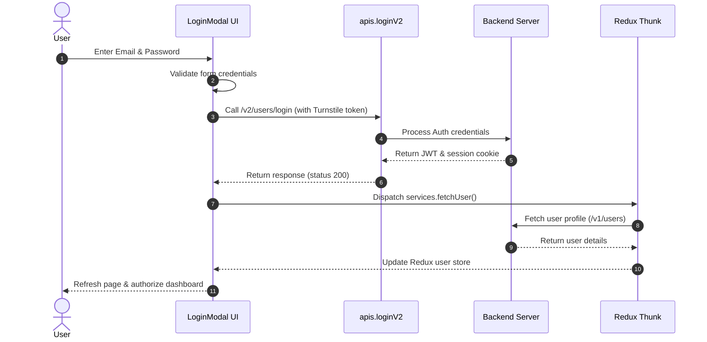

### Google Sign-in Workflow
- Initiated by clicking "Google Sign-in" button which opens a centered popup window at `/google-signin`.
- The popup page calls NextAuth's `signIn("google")`.
- Callback intercepts profiles, registers credentials via `apis.googlesignin`, writes tokens, and triggers a window communication event:
  `window.opener.postMessage({ type: "AUTH_SUCCESS", email, userType })`
- Parent login listener catches `AUTH_SUCCESS` and calls `window.location.reload()`.

### Session & Cookies Persistence
- **Tokens**: Server writes an encrypted auth cookie (defined by `cs-token`) with HttpOnly security configurations.
- **Local Storage**: Whitelisted Redux states (such as active user, watchHistory) are serialized and encrypted before being written to localStorage.
- **Logout Logic**: Triggers `apis.logout()`. This flushes unsaved loc_points and watch history updates via WebSocket sockets, clears local session cookies, deletes the Firebase messaging token, removes `"videoTour"` from localStorage, and triggers a UI reset.

---

## 8. API Analysis

### Core Endpoints Table

| Route Pattern | Method | Request Payload | Response Body | Authentication | Used By |
| :--- | :--- | :--- | :--- | :--- | :--- |
| `/v2/users/login` | POST | `{ email, password, captcha, src }` | `{ success: true, token, userType }` | Turnstile verification | `LoginModal` |
| `/v1/auth/logout` | GET | None | `{ success: true }` | Cookie-based session | `ReduxContent` logout handler |
| `/v1/users/getuser` | GET | Query params: `id` or `email` | `{ success: true, result: { userObj } }` | Session Required | Thunk user service |
| `/v2/courses/course-details` | PATCH | FormData / JSON course details | `{ success: true, result: { courseObj } }` | Session Required (Creator) | `UploadCourse` forms |
| `/v1/practice-problems/single` | GET | Query params: `slug`, `type` | `{ success: true, result: { problemObj } }` | Public (with session check) | `CodeEditorPage` |
| `/v1/practice-problems/run` | POST | `{ problemId, language, code }` | `{ success: true, result: { runDetails } }` | Session Required | Code compiler console |
| `/v1/practice-problems/submit` | POST | `{ problemId, language, code, timeTaken }` | `{ success: true, result: { submissionDetails } }` | Session Required | Code compiler console |

---

## 9. Redux / Context Analysis

### State Flow Architecture
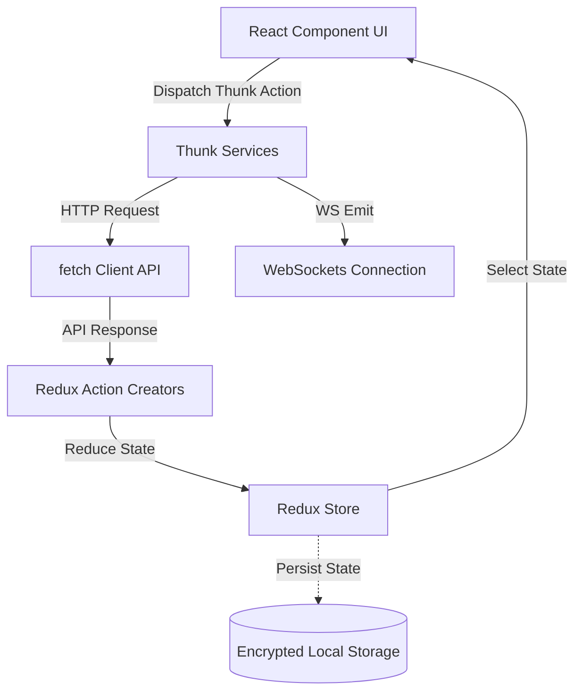

### Primary State Slices
1. **`user`**: Stores logged-in profile fields.
2. **`modal`**: Visibility state flags (`signinModal`, `pointsModal`, `creatorModal`, `feedbackModal`, `passwordModal`, `experienceModal`, `educationModal`, `projectModal`, `skillModal`, `testLinkModal`).
3. **`codingProblem`**: Compiler settings (`question`, `showTestCases`, `testCaseType`, `status`, `statusData`, `violations`, `internalCopyHistory`, `type` [coding/sql]).
4. **`video`**: Track details (`videoInfo`, `articleInfo`, `courseInfo`, `testInfo`).
5. **`theme`**: Active styling themes (`light` / `dark`).
6. **`loc_points`**: Unsaved watch points accumulated on the client.

---

## 10. Hooks

### `useApi`
- **Purpose**: Declarative API handler.
- **Parameters**: `apiFunc` (Axios-like endpoint callback).
- **Return values**: `{ data, error, loading, request }`.
- **Components using it**: Dynamic course grids, category filters.

### `useTimeTracking`
- **Purpose**: DSA solution timer.
- **Parameters**: `problemId` (String).
- **Return values**: `{ startTracking, saveTime, getTime, clearTime }`.
- **Components using it**: Monaco Editor code workspace wrapper.

### `useCodeAutoSave`
- **Purpose**: Local backups for code editor scripts.
- **Parameters**: `{ userId, problemId, language, code, enabled }`.
- **Return values**: `{ loadCode, clearCode, saveImmediately }`.
- **Components using it**: `CodeEditor` workspace interface.

### `useSessionRevoked`
- **Purpose**: Client active multi-session limit listener.
- **Parameters**: `onRevoked` (callback function).
- **Return values**: None.
- **Components using it**: `PlayerSide`, `RightPanel`.

---

## 11. Utilities

### `isLogin` (`src/utils/helper.js`)
- **Purpose**: Validates authentication state.
- **Inputs**: `user` object.
- **Outputs**: `boolean` (true if email is present or `login_state` cookie is true).

### `generateCloudUrl` (`src/utils/helper.js`)
- **Purpose**: Maps content keys to target CloudFront CDN pathways.
- **Inputs**: `type` (string), `response` (filename), `i` (index).
- **Outputs**: CloudFront asset URL.

### `shouldUpdateLife` (`src/utils/helper.js`)
- **Purpose**: Computes watch duration and updates local points cache.
- **Inputs**: `timeSpent` (number), `prevLife` (cached watch points state).
- **Outputs**: None. Syncs data with IndexedDB table `"service-life"`.

---

## 12. Services

- **Firebase Cloud Messaging (FCM)**: Configured in `firebaseInit.js`. Registers background Service Workers, requests notification permissions, and binds listeners for push updates.
- **WebSockets Manager**: Single socket connection interface for real-time progress logging, points additions, follow hooks, and comments.
- **IndexedDB Wrapper**: Uses `localforage` instance to securely store local session states, temporary watch limits, and user preferences.

---

## 13. Forms

### Login & Registration Forms (`src/components/modals/auth`)
- **Fields**: FirstName, LastName, Email, MobileNo, Password, Turnstile Captcha.
- **Validations**: Formik and Yup validations:
  - Email: Required, must match valid email format patterns.
  - Password: Required, min 6 characters.
  - MobileNo: Must be exactly 10 digits.
- **Submit Flow**: Dispatches API requests (`loginV2` or `register`). If successful, closes modal and triggers a page reload.

### Profile Form (`src/components/modals/profile/personal`)
- **Fields**: Profile Picture, Name, Title, Social profiles.
- **Validations**: String verification rules. Updates user collection details via `apis.updatepersonaldetails`.

---

## 14. Tables

### Practice Problems Grid (`src/app/(root)/_practice/problems/partials/problem-table`)
- **Columns**: Status Icon (solved/unsolved), Title (slug link), Tags/Topic labels, Difficulty Level (Easy, Medium, Hard), Action link (Run arrow).
- **Sorting / Filtering**: Dropdown selections filter columns by Topic, Difficulty, Company, or Problem Type.
- **Pagination**: Next/Prev pages are handled by `Components.Pagination`.

---

## 15. Modals / Dialogs

- **Auth Modal**: Triggered by user clicks or route guard redirects. Closes by dispatching `toggleSigninModal`. Binds form submissions.
- **Test Link Modal**: Displays stats and marks before a test. Triggers when a test is selected.
- **Warning Alert Dialog**: Warns users about screen resize violations or multi-device concurrency limits.

---

## 16. Notifications

- **Toasts**: Handled globally via `react-toastify` (`ToastContainer` in root layout). Displays code save states, login feedback, or errors.
- **Snackbars**: Interactive toast alerts configured with autoClose (4000ms) and dark theme layout parameters.

---

## 17. Search / Filter / Pagination

- **Search**: Inputs are bound to debounced states (using `useDebounce` with 500ms delay to limit API calls). Dispatches requests to `/v1/search?query=...` or `/v1/practice-problems`.
- **Filtering**: Dropdown inputs trigger Redux selectors, resetting the active pagination page to `1`.
- **Pagination**: Displays total pages. Renders numeric buttons, updating the current page index.

---

## 18. Security

- **Anti-Cheat Proctoring**: Captures editor focus, monitors window switches, intercepts pastes, and runs AES-GCM checks against the copy-paste storage arrays to detect external code inserts.
- **Session Limits**: Socket listener detects `session:revoked` events and redirects users or displays locking dialogs.
- **XSS Protections**: Uses `dompurify` to sanitize HTML output text inputs and article descriptions.

---

## 19. Performance

- **Lazy Loading**: Next.js dynamic imports (`dynamic()`) are configured for heavy subcomponents (e.g. Monaco Editor component is imported with `ssr: false`).
- **Memoization**: Implements `React.memo` for static course list grids and detail layouts.

---

## 20. Accessibility

- **Semantic HTML**: Renders layout structures using `<main>`, `<aside>`, `<section>`, `<header>`, `<nav>`, and `<footer>` elements.
- **ARIA bindings**: Buttons include `aria-label` tags, and icons are marked with `aria-hidden="true"`.

---

## 21. Complete QA Analysis

This QA checklist maps typical functional scopes across core page routes.

### Courses landing Page (`/courses`)
- **Smoke Tests**: Verify page loads without console exceptions. Ensure navbar, profile avatar, and course grids render.
- **Sanity Tests**: Check theme toggle triggers dark/light mode adjustments. Verify categories slider scrolls.
- **Functional Tests**: Click course card to ensure it redirects to correct details view `/courses/[slug]`.
- **Regression Tests**: Verify user progress percentage update calculations are correct.

### Learning player Page (`/courses/[slug]/[video]`)
- **Smoke Tests**: Verify video.js container mounts.
- **Functional Tests**: Click video progress bar to seek. Ensure watch progress updates via sockets.
- **Edge Cases**: Play video under low-bandwidth networks. Verify Quality selector drops resolutions automatically.
- **Sanity Tests**: Claim certificate on course completion. Verify the input fields are locked post-submission.

### Practice dashboard Page (`/_practice/problems`)
- **Sanity Tests**: Access page as guest. Ensure only first 3 rows are unlocked and `GuestLock` overlay is shown.
- **Functional Tests**: Enter text in search field. Verify results filter after debounce timer.
- **Negative Tests**: Select conflicting filter attributes (e.g. difficulty Hard and easy topic). Verify empty table placeholders display.

### Online code IDE Page (`/_practice/problems/[slug]`)
- **Smoke Tests**: Verify Monaco editor renders.
- **Functional Tests**: Enter a solution, click "Run". Verify outputs print in console log.
- **Negative Tests (Proctoring E2E)**: Paste code copied from an external text editor. Verify that a warning appears and a violation is logged.
- **Edge Cases**: Trigger screen resize or tab switches. Verify that proctoring alerts trigger.

---

## 22. Playwright Automation Planning

This section provides locator recommendations and automation tips.

### Element Selectors & Locators

- **Authentication Modal Inputs**:
  - Email Field: `page.locator('input[type="email"]')`
  - Password Field: `page.locator('input[type="password"]')`
  - Login Button: `page.getByRole('button', { name: /login/i })`

- **Navbar Components**:
  - Theme Toggle: `page.locator('#nav-mode')`
  - Profile Icon: `page.locator('#nav-avatar')`
  - CipherPoints Panel: `page.locator('#nav-cipher-points')`

- **Compiler Page controls**:
  - Run Code Button: `page.getByRole('button', { name: /run/i })`
  - Submit Solution Button: `page.getByRole('button', { name: /submit/i })`
  - Console Log: `page.locator('.console-output')`

### Flaky Areas & Wait Strategies
- **Monaco Editor Mounts**: Monaco loads libraries asynchronously. E2E tests should wait for the loader to clear (`page.waitForSelector('.monaco-editor')`) before typing.
- **Redux Hydration**: Use `page.waitForFunction()` to verify state properties or wait for loading skeletons (`.SkeletonElement`) to detach before clicking.
- **Turnstile Captchas**: Disable Turnstile in sandbox environments using configuration keys, or mock API responses for CAPTCHA validations.

### Mocking API Calls & WebSocket Actions
- Intercept the initial auth call to return mock details:
  `await page.route('**/v2/users/login', route => route.fulfill({ status: 200, body: JSON.stringify({ token: "mock-jwt" }) }));`
- Intercept compiler runs to avoid executing CPU-heavy scripts on remote compiler backends:
  `await page.route('**/v1/practice-problems/run', route => route.fulfill({ status: 200, body: JSON.stringify({ success: true, result: { runDetails: { status: "passed" } } }) }));`

---

## 23. Automation Framework Recommendation

For an enterprise-level test suite, a modular **Playwright** framework with Page Objects, custom fixtures, and isolated test configurations is recommended.

```
playwright-framework/
├── config/
│   ├── playwright.config.js       # Playwright E2E configurations
│   └── constants.js              # Environment URLs, test user credentials
├── fixtures/
│   └── test-fixtures.js          # Custom test fixture (injects pre-logged in users)
├── pages/
│   ├── BasePage.js               # Common actions (alerts handling, wait loaders)
│   ├── LoginPage.js              # Login selectors and workflows
│   ├── CoursePlayerPage.js       # Video seeker, speed rates selectors
│   └── CompilerPage.js           # Monaco workspace selectors, run/submit handlers
├── tests/
│   ├── auth.spec.js              # Login, register, forgot-password E2E tests
│   ├── proctoring.spec.js        # Tab switch and paste violation tests
│   └── compiler.spec.js          # Code run, submit and test case assertions
└── utils/
    ├── db-helper.js              # Database seed scripts for test setups
    └── telemetry-listener.js     # Validates sent telemetry payloads
```

### Key Implementation Guidelines
- **Avoid Hard Sleep calls**: Use element states (`waitForSelector({ state: 'visible' })`) to handle page timing.
- **Mock WebSockets**: Emulate socket events (like `session:revoked` or points updates) using mock servers to verify real-time UI reactions.
- **Telemetry Verification**: Run tests against a test collector endpoint, and query the collector API to assert that correct tracing attributes are dispatched.

---

## 24. Risks

- **Flaky Monaco Editor Types**: Typings inside Monaco editor frames can lose focus. Use specialized typing helper methods.
- **Concurrency Session Limits**: If a test user has multiple active sessions, they may trigger session limit locks. Clean up sessions by running logout routines at the end of each test.
- **Proctoring Sensitivities**: Screen sizes and window focus variations can trigger false-positive anti-cheat warnings in headless browsers. Run proctoring E2E tests in windowed/headed modes.

---

## 25. Improvement Suggestions

- **Test ID bindings**: Add explicit `data-testid` properties to key elements (buttons, inputs, status cards) to decouple tests from visual selectors and layout changes.
- **Telemetry sandboxes**: Add a telemetry disable flag specifically for local testing environments to avoid polluting production analytics.
- **WebSocket Mock interfaces**: Expose a window utility hook (`window.mockSocketMessage(event, payload)`) inside testing builds to make WebSocket UI assertions easier.

---

## 26. Architecture Diagrams

### Overall Architecture
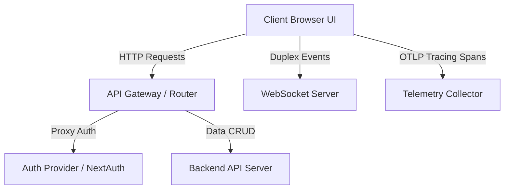

### Folder Hierarchy
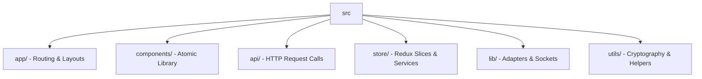

### Component Hierarchy
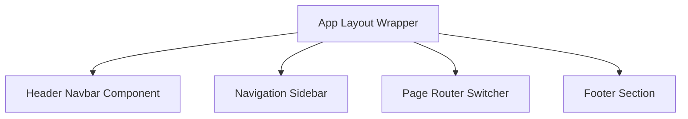

### Routing Flow
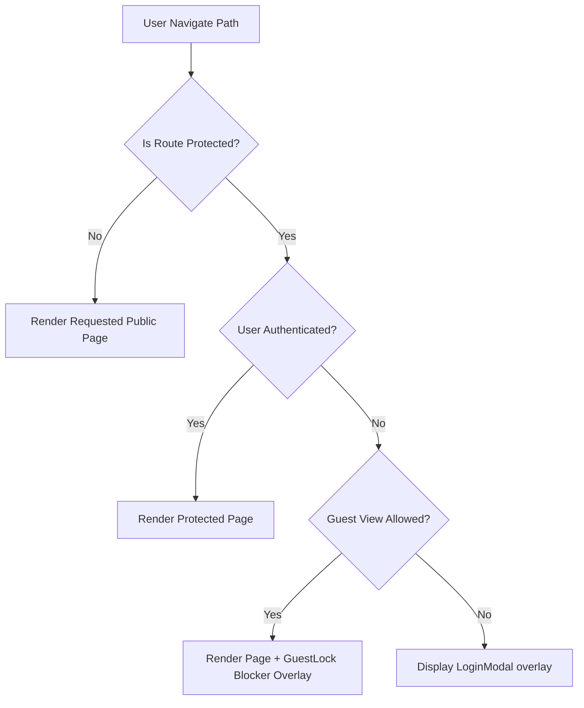

### Authentication Flow
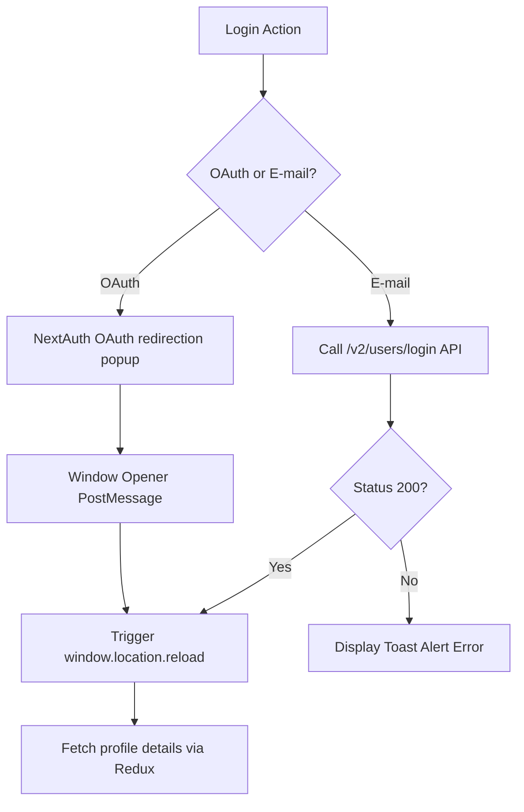

### API Flow
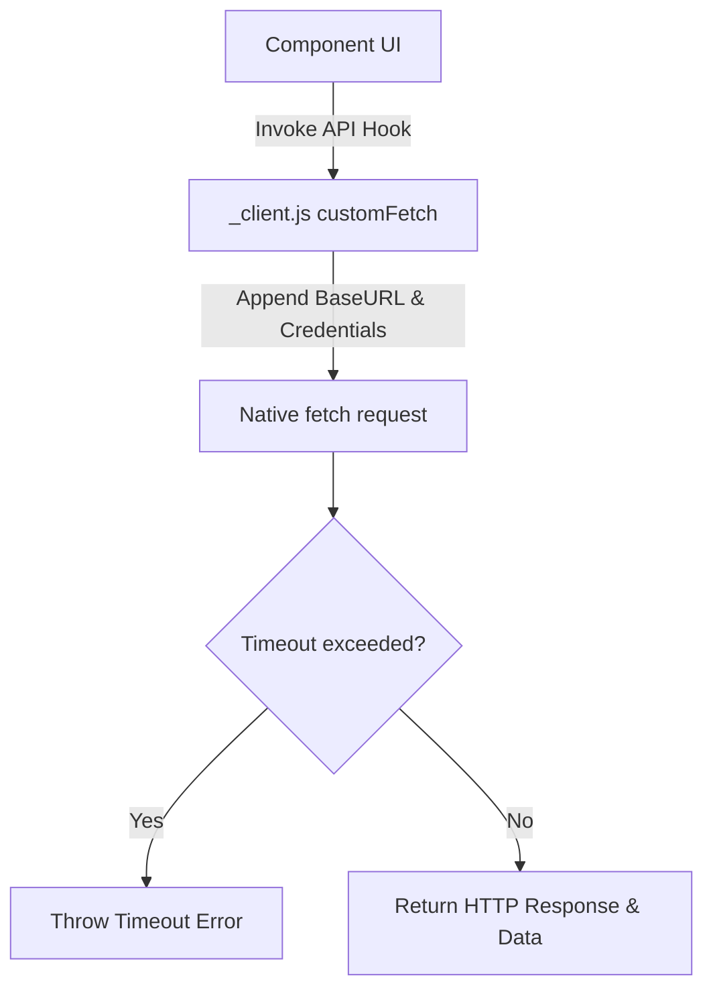

### State Flow
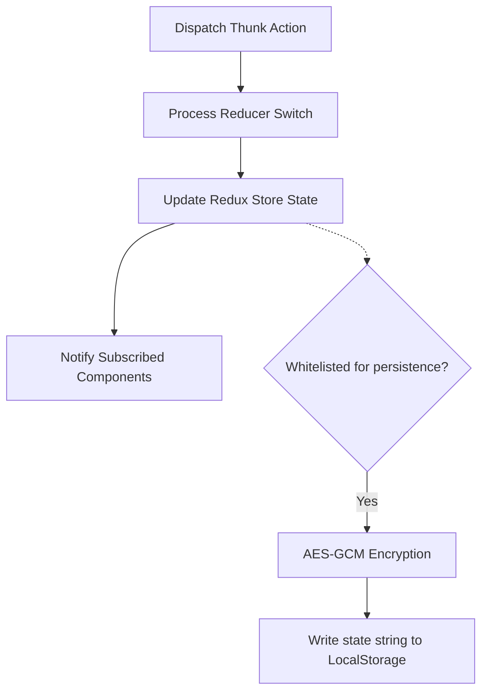

### Navigation Flow
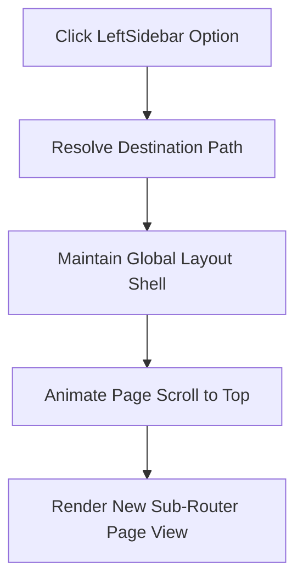

### User Flow (Solving a DSA Problem)
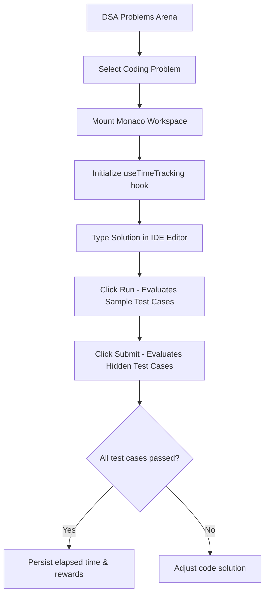

---

## 27. Automation Coverage Matrix

This matrix prioritizes testing scopes across key pages and components.

| Page / Route | Core Components | Target APIs | Smoke Priority | Regression Priority | Functional Priority | E2E UI Priority | Priority |
| :--- | :--- | :--- | :--- | :--- | :--- | :--- | :--- |
| `/` (Landing Page) | Navbar, Footer, Carousel, Accordion | `/v1/courses/trend` | High | Medium | Low | High | Medium |
| `/courses` | Categories, CardGrid, BreakPoint | `/v1/courses/all`, `/v1/courses/ctg` | High | High | High | Medium | High |
| `/courses/[slug]/[video]` | VideoPlayer, Accordion, Comments | `/v2/courses/link`, `/v1/comments` | High | Critical | Critical | Critical | Critical |
| `/profile/me` | ProfileHeader, HeatMap, Forms | `/v1/users/getuser`, `/v1/users/personal` | High | High | Critical | Medium | High |
| `/_practice/problems` | ProblemsTable, Pagination, Filters | `/v1/practice-problems` | High | High | High | Medium | High |
| `/_practice/problems/[slug]`| MonacoEditor, ConsolePanel, Footer | `/v1/practice-problems/single`, `/run` | Critical | Critical | Critical | High | Critical |
| `/upload/course` | StageModal, CurriculumBuilder, Forms | `/v2/courses/course-details` | Medium | High | High | Medium | High |

---

## Summary of Framework Architecture Recommendations

1. **Clipboard Interception**: Since the anti-cheat system reads the clipboard on paste events, E2E scripts must override the page's permissions (`await context.grantPermissions(['clipboard-read', 'clipboard-write'])`) and mock clipboard data to verify both allowed internal edits and proctoring violation alerts.
2. **Deterministic Timeouts**: Since Monaco takes time to bind key listeners and custom debounce hooks execute updates 700ms after user typing ceases, Playwright tests should use `page.waitForResponse` rather than fixed duration sleeps to make sure tests match execution speeds.
3. **Environment Isolation**: Set `NEXT_PUBLIC_SITE_ENV=qa` in QA environments to avoid telemetry and tracking scripts reporting E2E operations.
