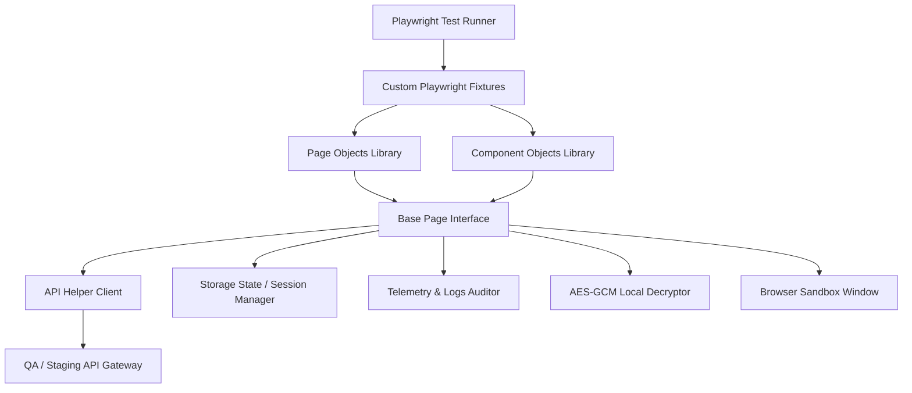
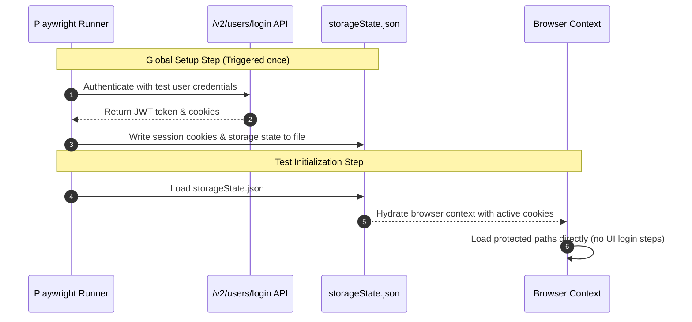

# Playwright Automation Framework Architecture Design Document

**Document Name:** Playwright_Framework_Design.md  
**Author:** Principal QA Automation & Enterprise Software Architect  
**Project Context:** CipherSchools Client Application  

---

## 1. Framework Goals

This design defines the architecture for a scalable, enterprise-grade Playwright E2E automation framework customized for the CipherSchools client.

### Business Goals
- **Accelerate Time-to-Market (TTM)**: Shrink regression testing cycles from days to minutes.
- **Protect Core Revenue Flows**: Prevent critical bugs in checkout flows, courses access, and code editor pages.
- **Ensure Platform Trust**: Verify that proctoring checks (copy-paste blocks, resize alerts) are active.

### Technical Goals
- **Zero Flakiness**: Implement structured waiting strategies to eliminate arbitrary sleeps.
- **Parallel and Fast**: Scale parallel workers to maintain total test suite runtimes below 5 minutes.
- **Deep Visibility**: Integrate network logs, screenshots, console logs, and traces into test reports.

### Maintainability Goals
- **Dry Execution & Low Code Churn**: Abstract UI elements into reusable Page Objects and Component Objects.
- **Decoupled Data and Code**: Keep credentials and mock payloads separated from test code.

### Scalability Goals
- **Scaling Test Count**: Design the framework to support growth from 100 to 1,000+ tests.
- **Cross-Team Ready**: Standardize fixtures and page methods so multiple feature teams can collaborate.

### Developer & QA Experience
- **Developer Experience (DX)**: Simple command syntax to run localized tests on dev machines.
- **QA Experience (QX)**: Unified HTML reports, visual diffs, and detailed logs for fast debugging.

---

## 2. Overall Framework Architecture

The framework utilizes a layered, modular Page Object Model (POM) architecture powered by Playwright Custom Fixtures and API integrations.



### Authentication State Management


### Why This Architecture Fits CipherSchools
1. **Handles Device Session Limits**: Bypasses the active device session checker by directly injecting authorized storage states, preventing false-positive lockout errors.
2. **Automates Proctoring Violations**: Standard Playwright contexts are configured with clipboard read/write permissions pre-granted, allowing tests to simulate external code pastes and assert that proctoring alerts trigger.
3. **Decouples Monaco IDE Setup**: Isolates Monaco Editor frames into a specialized component object, hiding async loading behaviors behind clean, test-facing actions.

---

## 3. Recommended Folder Structure

```
playwright-framework/
├── .github/
│   └── workflows/
│       └── e2e-pipeline.yml         # CI/CD action workflow config
├── config/
│   ├── playwright.config.ts        # Global Playwright config
│   ├── environments.config.ts      # URL and gateway configurations
│   └── constants.ts                # App timeouts and static properties
├── src/
│   ├── api/
│   │   ├── BaseClient.ts           # Axios or fetch Client wrapper
│   │   └── AuthClient.ts           # Login/Logout payload wrappers
│   ├── fixtures/
│   │   └── custom-fixtures.ts      # Custom auth, API, and setup fixtures
│   ├── pages/
│   │   ├── BasePage.ts             # Common navigation and waiting actions
│   │   ├── LoginPage.ts            # Auth forms and Turnstile selectors
│   │   └── CompilerPage.ts         # Code IDE editor page object
│   ├── components/
│   │   ├── Navbar.ts               # Header, theme, points component
│   │   ├── LeftSidebar.ts          # Main navigation bar component
│   │   ├── VideoPlayer.ts          # HTML5 player actions component
│   │   └── MonacoEditor.ts         # Monaco editor input wrapper
│   ├── locators/
│   │   ├── page-locators.ts        # Static page-level DOM selectors
│   │   └── component-locators.ts   # Component-level DOM selectors
│   ├── utils/
│   │   ├── db-helper.ts            # Test DB cleanup scripts
│   │   └── crypto-helper.ts        # Decrypts AES-GCM local storage
│   └── helpers/
│       ├── clipboard.ts            # Clipboard mock handlers
│       └── telemetry-auditor.ts    # OpenTelemetry trace verifiers
├── data/
│   ├── users/
│   │   ├── admin.user.json         # Static admin account details
│   │   └── creator.user.json       # Static creator account details
│   └── mocks/
│       └── run-response.json       # Mock compiler return payloads
├── artifacts/
│   ├── downloads/                  # Saved assignments/certificates
│   ├── screenshots/                # Assertion failure snapshots
│   ├── videos/                     # Playback recordings
│   └── traces/                     # Zip trace archives for debugging
└── reports/
    └── html-report/                # Playwright HTML execution reports
```

---

## 4. Test Organization Strategy

Tests are organized into structured directories mapping to the test type and execution priority:

- **Smoke Suite (`/tests/smoke`)**: Validate the primary happy paths (e.g. login, load course explorer, run compiler, verify profile loads). Run on every PR merge request.
- **Sanity Suite (`/tests/sanity`)**: Quick integration checks verifying environment integrity post-deployment (e.g. status 200 on all main API paths).
- **Regression Suite (`/tests/regression`)**: Extended test cases covering corner cases, user paths, and validation rules. Run nightly.
- **API Suite (`/tests/api`)**: Direct REST API payload assertions bypassing UI windows.
- **Visual Suite (`/tests/visual`)**: Pixel-by-pixel comparisons of layout structures (e.g. heatmap grids, certificate templates) using `toHaveScreenshot()`.
- **Accessibility Suite (`/tests/accessibility`)**: Integrates `@axe-core/playwright` to run automated audits against WCAG accessibility rules.
- **Responsive Suite (`/tests/responsive`)**: Run E2E tests across viewport footprints (desktop, tablet, mobile layouts) to verify responsive menus and overlays.
- **Negative & Edge Cases (`/tests/negative`)**: Validate boundaries, invalid credential forms, and proctoring violation alerts.

---

## 5. Page Object Strategy

### Design Patterns
- **Strict Separation of Concerns**: Page Objects contain only locator definitions and page-specific interactions. Assertions reside inside the test script.
- **Fluent Interface Design**: Return instances of the target Page Object from page methods to chain actions.

### Target Page Objects

```
          ┌──────────────┐
          │   BasePage   │
          └──────┬───────┘
                 │
      ┌──────────┴──────────┐
      ▼                     ▼
┌──────────┐          ┌──────────┐
│LoginPage │          │CoursePage│
└──────────┘          └────┬─────┘
                           │
                           ▼
                     ┌──────────┐
                     │PlayerPage│
                     └──────────┘
```

#### `BasePage`
- **Why**: Centralizes common actions, logging, and error handling.
- **Responsibilities**: Shared wait hooks, layout interactions, screenshot captures, navigation logs, and frame handlers.

#### `LoginPage`
- **Why**: Handles credentials login, signup forms, and Turnstile integrations.
- **Responsibilities**: Submitting email credentials, checking captcha flags, verifying OTP verification screens.

#### `CourseExplorerPage`
- **Why**: Manages course searching and category filtering.
- **Responsibilities**: Inputting search terms, clicking categories, scrolling course grids.

#### `VideoPlayerPage`
- **Why**: Handles video player screens and content layouts.
- **Responsibilities**: Interacting with video controls, seeking progress bars, creating notes, submitting comments.

#### `CompilerPage`
- **Why**: Manages the coding compiler arena.
- **Responsibilities**: Selecting languages, submitting code, verifying test result outputs.

#### `ProfileMePage`
- **Why**: Handles user profile configurations.
- **Responsibilities**: Editing details, updating experience/education cards, checking heatmaps.

#### `CourseUploadPage`
- **Why**: Controls creator upload step wizards.
- **Responsibilities**: Filling course structure forms, adding curriculum components, setting price tiers.

---

## 6. Component Object Strategy

Reusable frontend elements are abstracted into Playwright Component Objects to make the test code modular and easier to maintain.

- **`Navbar`**: Manages search inputs, theme selectors, notification panels, and profile menus. Used across all layout headers.
- **`LeftSidebar`**: Controls navigation menu links and expanded/collapsed states.
- **`VideoPlayer`**: Handles video playback, play/pause controls, seek timelines, and playback speed adjustments.
- **`MonacoEditor`**: Interfaces with Monaco IDE. Handles loading checks, code typing, and draft saves.
- **`ProblemTable`**: Interacts with the practice coding grid, filters columns, and verifies pagination.
- **`Toast`**: Validates alert notifications (success, warning, error messages).
- **`Modal`**: Base wrapper handling popup layouts, close triggers, and title verifications.

---

## 7. Base Page Responsibilities

The `BasePage` serves as the base class for all Page and Component Objects, wrapping Playwright's native API to provide robust, reusable helper methods:

- **Navigation**: Wraps `goto` with error handling, logging URL navigation paths, and verifying document load states.
- **Waiting Hooks**: Provides structured wait hooks for loaders (`PageLoader`, `ImageLoader`) to detach, and element selectors to become visible/hidden.
- **Keystroke Controls**: Implements helper methods for focused keystrokes inside Monaco Editor text areas.
- **Iframe Operations**: Automatically locates and switches contexts to nested frames (such as embedded Google Forms iframes).
- **Dialog Interceptions**: Sets up dynamic listeners to intercept, log, or accept browser alerts.
- **Media Downloads**: Captures and routes downloaded certificates or assignment files.
- **Test Artifacts Generation**: Triggers screenshots, trace files, and video recordings on failure events.

---

## 8. Fixtures Strategy

Playwright Custom Fixtures are used to configure test prerequisites, inject storage states, and manage resources:

- **`authenticatedContext`**: Returns an authenticated browser context loaded with saved cookies, skipping the login screen for protected paths.
- **`anonymousContext`**: Returns a clean browser context with all storage states cleared for public and registration path testing.
- **`apiClient`**: Returns an authenticated REST client configured to make API requests directly to backend services.
- **`compilerSetup`**: Derived fixture that clears IndexedDB editor drafts before test cases run.
- **`telemetryAuditor`**: Mounts a custom OpenTelemetry collector handler to verify tracer events.
- **`testDataHelper`**: Helper utility that returns random, parameterized data sets for forms testing.

---

## 9. Test Data Strategy

- **Test Accounts**: Keep static credentials for multiple user roles (`admin`, `creator`, `student`, `guest`) in encrypted files (`data/users/*.json`), referenced in configurations.
- **Mock Datasets**: Store static JSON mock payloads for compiler outputs, analytics reports, and list pages in `data/mocks/`.
- **Dynamic & Random Data**: Use Fakers to generate random names, emails, and phone numbers for signup and profile forms testing.
- **Environment Configurations**: Manage base URLs, database connection strings, and backend ports using environment config files.
- **Database Cleanup Scripts**: Utilize DB helper utilities to prune created test accounts and course uploads at the end of test runs to keep the database clean.

---

## 10. Locator Strategy

Playwright tests use a strict, prioritized locator selection hierarchy to ensure selectors remain stable as UI designs change:

1. **`page.getByTestId('name')`**: Priority 1. The most stable locator, decoupled from styling and layout updates.
2. **`page.getByRole('type', { name: 'text' })`**: Priority 2. Aligns selectors with accessibility definitions.
3. **`page.getByPlaceholder('text')`**: Priority 3. Highly effective for input fields.
4. **`page.getByLabel('text')`**: Priority 4. Binds label relationships on forms.
5. **`page.locator('css')`**: Priority 5. Used for structured CSS selectors (e.g. `.monaco-editor`).
6. **`page.locator('xpath')`**: Priority 6. Strongly discouraged; used only as a last resort.

### Best Practices
- **Do not use auto-generated locators**: Avoid brittle locators like `page.locator('div > span > input')`.
- **Prefer Data Test IDs**: Add `data-testid` attributes to critical elements like compiler actions, profile editing buttons, and video players.

---

## 11. Waiting Strategy

To eliminate test flakiness, Playwright E2E tests avoid arbitrary wait timers and instead wait for specific page events:

- **Auto-Waiting**: Leverage Playwright's built-in auto-waiting, which verifies elements are attached, visible, stable, and ready to accept clicks before executing actions.
- **API Response Syncing**: Use `waitForResponse` to block test execution until critical API updates complete (e.g., waiting for code execution calls to return status 200).
- **Element State Transitions**: Wait for loading spinners (`CircleLoader`) and skeleton rows to detach, and success toast popups to become visible.
- **Video Ready States**: Run client-side scripts to verify that the video player's `readyState` is active before triggering seek actions.

---

## 12. Assertion Strategy

Assertions verify application states using Playwright's web-first assertions, which feature built-in auto-retries:

- **UI Validations**: Assert element visibility and states (`toBeVisible()`, `toBeDisabled()`).
- **Route Redirections**: Validate active path redirections (`toHaveURL()`).
- **Form Error Messages**: Verify error alerts and invalid fields (`toContainText()`).
- **API Integrity Checks**: Validate response status codes, payload shapes, and data values.
- **Visual Auditing**: Use `toHaveScreenshot()` to catch visual regressions in profile heatmaps or certificate previews.

---

## 13. Authentication Strategy

- **Session Reuse**: Run credential login steps once in a global setup test. Save the authenticated context state (cookies and localStorage) to a JSON file.
- **Injecting State**: Configure the test runner to load this JSON file into browser contexts, skipping login screens for E2E tests.
- **Role Isolation**: Maintain separate storage states for different roles (`admin`, `creator`, `student`), allowing tests to switch roles by injecting different JSON configurations.

---

## 14. API Testing Strategy

- **API-First Setup**: Use direct API calls to create user accounts, enroll in courses, or clear profiles before running UI tests.
- **Intercepting API Calls**: Use `page.route` to mock slow or unstable endpoints (e.g., mocking third-party integrations like Cloudflare Turnstile).
- **Evaluating Compilations**: Intercept code submission calls and return mock compilation outputs to test compiler UI behaviors without calling backend servers.

---

## 15. Reporting Strategy

The framework generates multiple report formats to fit different execution contexts:

- **HTML Report**: Standard report format, providing trace files, failure screenshots, console logs, and step executions.
- **Allure Reporting**: High-level, interactive reporting dashboard showing historical runs, flaky metrics, and test categorization.
- **Failure Artifacts**: Configure the test runner to capture screenshots, video recordings, and trace zip files on test failures.
- **HAR Network Archives**: Capture network archives on failed test runs to debug API timing and response issues.

---

## 16. Logging Strategy

- **Test Lifecycle Logging**: Print clear info logs when tests start, complete actions, or fail.
- **HTTP Payload Logging**: Log request headers, payload shapes, and API response metrics.
- **Console and Network Logging**: Capture client-side browser console outputs and network traffic during test execution.
- **Trace Integration**: Embed detailed logging actions directly into Playwright trace timelines.

---

## 17. Retry Strategy

- **Flaky Tests Isolation**: Configure the test runner to retry failed tests twice. If a test passes on retry, mark it as "flaky" in reports to alert the team.
- **Failure Snapshot Policy**: Capture screenshots on the first failure of a test.
- **Failures Trace Policy**: Enable trace file generation on retried test runs to capture complete failure logs without overhead on passing tests.

---

## 18. Parallel Execution Strategy

- **Parallel Workers**: Distribute E2E tests across parallel workers based on available CPU cores.
- **Test Isolation**: Run tests in isolated browser contexts, preventing shared mutable states between runs.
- **Handling Shared Resources**: Use separate test user accounts and distinct courses/problems for each worker to prevent resource conflicts.
- **Execution Ordering**: Group tests by feature and project, running independent UI tests before long, stateful flows.

---

## 19. Browser Strategy

E2E tests run across multiple browser engines and viewports configured in projects:

- **Chromium Project**: Runs tests on Chrome and Edge. Targets standard desktop resolutions.
- **Firefox Project**: Verifies layouts and rendering in Gecko engines.
- **WebKit Project**: Verifies layouts in Safari engines.
- **Mobile Project**: Simulates viewports and touch interactions for iOS Safari and Android Chrome.

---

## 20. Environment Strategy

- **Local Development**: Runs tests against local dev builds, using mock databases and mock payment servers.
- **QA / Staging Sandbox**: Integrates with QA builds to run regression testing pipelines.
- **Production Verification**: Runs sanity test sets against production environments.
- **Configuration Management**: Decouple environment configs by loading variables from environment files using a unified configurations manager.

---

## 21. Component Mapping

```
[React Frontend Component]
          ↓
[Playwright Component Object]
          ↓
   [Page Objects]
          ↓
  [E2E Automation Reuse]
```

| Frontend Component | Component Object Class | Used In Pages | Automation Reuse |
| :--- | :--- | :--- | :--- |
| **`Navbar`** | `Navbar` | Home, Courses, Profile | Validates header search inputs, profile avatar clicks, and theme toggles. |
| **`LeftSidebar`**| `LeftSidebar` | VideoPlayer, Practice, Editor | Validates main menu navigations and panel expansion widths. |
| **`LoginModal`** | `LoginModal` | Home, Courses, Practice | Validates email logins, signup forms, and error states. |
| **`VideoPlayer`**| `VideoPlayer` | VideoPlayerPage | Validates play controls, seek timelines, and playback speed. |
| **`MonacoEditor`**| `MonacoEditor` | CompilerPage | Validates typing code solutions, language selections, and saving drafts. |
| **`ProblemTable`**| `ProblemTable` | PracticeProblemsPage | Validates column headers, filter options, and pagination. |

---

## 22. Page Mapping

This mapping traces the relationships between page components, page objects, and backend API handlers:

```
[Practice Problems Page]
  └─► Page Object: `PracticeProblemsPage`
       ├── Component Object: `LeftSidebar`
       ├── Component Object: `ProblemTable`
       │    └── Element: `GuestLock`
       ├── API Service: `apis.getCipherLabsProblems`
       └── Fixture: `authenticatedContext` / `anonymousContext`

[Interactive Compiler Page]
  └─► Page Object: `CompilerPage`
       ├── Component Object: `LeftSidebar`
       ├── Component Object: `MonacoEditor`
       ├── Component Object: `Toast`
       ├── API Service: `apis.runPracticeCodingProblem`
       └── Fixture: `compilerSetup` (Prunes IndexedDB drafts)
```

---

## 23. Automation Priority Matrix

### Smoke Testing Priority (P0)
- **Email Credentials Sign-in**: Verify successful login with valid credentials.
- **Load Course Explorer Grid**: Verify that course catalogs load and display course cards.
- **Code Compilation Actions**: Type a code solution, click Run, and verify evaluation runs successfully.
- **Video Player Playback Controls**: Verify that a video mounts, plays, and seeks.

### Regression Testing Priority (P1)
- **Sign-up & Form Validations**: Verify signup validations (password limits, phone lengths).
- **Proctoring Violations**: Paste code copied from external editors and verify proctoring alerts trigger.
- **Device Limit Lockouts**: Verify that a user is blocked from viewing courses when their active session limit is exceeded.
- **Experience CRUD Actions**: Add, edit, and delete experience cards on the profile page.

### Extended Testing Priority (P2)
- **Weekly Practice Challenges**: Validate weekly practice calendar items and rankings.
- **Dynamic Course Upload Steps**: Build curriculum modules in the creator workspace.
- **Rewards Redemption Shop**: Verify reward items and transaction logs.

---

## 24. Test Tagging Strategy

Tests are tagged to allow running specific sub-suites:

- **`@smoke`**: Critical, happy-path test cases.
- **`@sanity`**: Quick post-deployment check tests.
- **`@regression`**: Comprehensive regression test suites.
- **`@api`**: API-only testing paths.
- **`@ui`**: Visual and UI layout tests.
- **`@auth`**: Session, role-switching, and login/logout tests.
- **`@responsive`**: Viewport layout and mobile menu checks.
- **`@proctor`**: Proctoring verification, copy-paste block, and resize check tests.

---

## 25. CI/CD Readiness

Playwright tests are integrated directly into CI/CD pipelines:

1. **Trigger Phase**: Execute tests on every PR merge request and nightly scheduler.
2. **Build and Setup Phase**: Install dependencies, configure cache layers, and provision test user credentials.
3. **Execution Phase**: Run Playwright tests in parallel, isolating each browser context.
4. **Artifact Collection Phase**: Save HTML reports, screenshots, videos, and trace files on failure events.
5. **Notification Phase**: Send test run summaries and failures reports to Slack or Teams.

---

## 26. Coding Standards

- **Naming Conventions**: Name test files as `[feature].spec.ts` and Page Objects as `[PageName].page.ts`.
- **Assertion Isolation**: Keep assertions inside test scripts (`.spec.ts`). Do not put assertions inside Page Object files.
- **Locator Declarations**: Define Page Object locators inside constructors. Do not write raw DOM selector strings inside page methods.
- **Structured Comments**: Add clean JSDoc comments to document page methods and custom fixtures.

---

## 27. Common Anti-Patterns

- **Avoid Hard Waits**: Do not use `page.waitForTimeout()`. Instead, wait for element visibility, loader detachment, or API responses.
- **Avoid XPath Overuse**: Do not use fragile XPath locators. Prefer `getByTestId()` or role-based locators.
- **Avoid Shared Mutable State**: Do not share user states or test data between workers. Keep each worker isolated.
- **Avoid Over-Asserting**: Avoid writing massive test cases with dozens of assertions. Break tests into focused, independent verification paths.

---

## 28. Framework Scalability

- **Maintain Test Isolation**: Keep E2E tests completely independent, allowing the suite to run on multi-core servers without conflicts.
- **Parallel Workers**: Scale parallel execution by running tests across multiple workers.
- **Database Seed Helpers**: Use API helpers to seed test databases dynamically, avoiding slow UI setup steps.
- **Modular Component Design**: Write reusable Page and Component Objects to keep maintenance overhead low as the test suite grows.

---

## 29. Future Enhancements

- **Accessibility Testing Integration**: Integrate `@axe-core/playwright` to run accessibility checks on every page.
- **Visual Regression Audits**: Implement visual comparison tests using `toHaveScreenshot()` to catch layout changes automatically.
- **Cloud Grid Execution**: Run tests on cloud grids like BrowserStack or LambdaTest for cross-browser and real-device testing.
- **Telemetry Monitoring**: Intercept and validate OpenTelemetry trace events sent by the client.

---

## 30. Implementation Roadmap

### Phase 1: Framework Setup (Week 1)
- Install Playwright dependencies.
- Configure folder structures and environment variables.
- Write base classes and custom fixtures.

### Phase 2: Session Reuse Setup (Week 1)
- Automate authentication workflows.
- Implement storage state caching.

### Phase 3: Smoke Test Suite (Week 2)
- Write Page Objects for login, explorer, and editor pages.
- Implement P0 smoke tests.

### Phase 4: CI/CD Pipeline Integration (Week 2)
- Configure CI/CD test runs.
- Set up reporting and notification flows.

### Phase 5: Regression Suite & Visual Tests (Week 3)
- Expand test coverage to include compiler, video player, and profile forms.
- Configure visual regression tests.
- Integrate accessibility checks.
