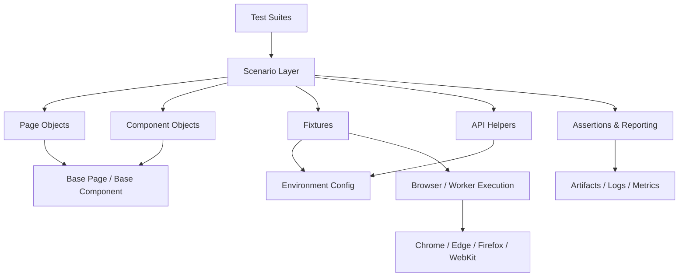
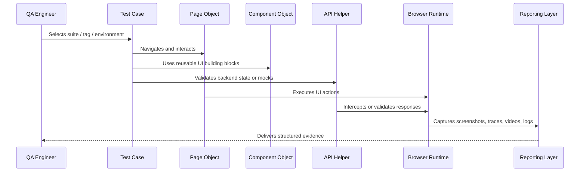

# Playwright Framework Design

## Purpose

This document defines the enterprise-grade Playwright automation framework architecture for the Playwright.CS platform. It is an automation framework design artifact, not application documentation and not implementation code. The design is intended to support smoke, sanity, regression, cross-browser, responsive, API, authentication, visual, accessibility, performance, and parallel execution scenarios for a modern learning platform with authentication, video learning, coding practice, creator workflows, and dashboard orchestration.

---

## 1. Framework Goals

### Business Goals
- Reduce release risk by validating critical user journeys before production deployment.
- Improve confidence in regression cycles for education, coding, and creator experiences.
- Provide fast feedback to QA, developers, and product teams with reusable automation assets.
- Enable consistent evidence for functional and non-functional quality across environments.

### Technical Goals
- Establish a scalable Playwright architecture that is browser-agnostic and environment-aware.
- Support both UI and API validation within the same test strategy.
- Create a clear separation between business flows, reusable UI components, test data, and infrastructure concerns.
- Enable deterministic execution with reliable waits, structured reporting, and artifact capture.

### Maintainability Goals
- Keep test code modular, readable, and aligned to the product domain.
- Separate page-specific behavior from reusable component behavior.
- Standardize naming, tagging, fixtures, assertions, and reporting practices.
- Minimize duplication by centralizing navigation, waits, environment handling, and common assertions.

### Scalability Goals
- Support growth from a small smoke suite to thousands of tests across multiple teams and products.
- Allow execution by suite, feature, tag, environment, or browser without redesign.
- Support parallel execution without shared-state contamination.
- Provide extensibility for visual, accessibility, and performance testing as maturity grows.

### Developer Experience
- Provide a simple onboarding path for new automation engineers.
- Make test authoring intuitive through standardized fixtures, reusable abstractions, and strong conventions.
- Produce actionable failure output with clear diagnostics, screenshots, traces, and logs.

### QA Experience
- Deliver dependable execution across local, QA, staging, and production-like environments.
- Make test selection straightforward through tags, suites, and environment profiles.
- Ensure that failed tests are easy to triage with artifacts and contextual information.

---

## 2. Overall Framework Architecture

The recommended architecture is a layered framework composed of:
- Test layer for business scenarios and suite organization.
- Page and component abstraction layer for UI interaction.
- Fixture and data layer for environment, authentication, and test input management.
- API and service layer for direct validation and mock control.
- Reporting and artifact layer for diagnostics and evidence.
- Execution layer for browser, worker, and environment orchestration.

### Architectural Principles
- Separation of concerns between UI behavior, test intent, and infrastructure setup.
- Reuse through component objects, shared fixtures, and central configuration.
- Deterministic execution through explicit waits and controlled state management.
- Evidence-driven reporting with trace, video, screenshot, network, and log capture.

### Recommended Layered Architecture



### Why This Architecture Fits This Project
This project includes a rich web experience with:
- Multi-step authentication and session handling.
- Complex interactive learning features such as video playback and coding exercises.
- Creator and profile management workflows.
- Multiple environments and browser contexts.
- Dynamic UI states and asynchronous loading.

The architecture above fits because it separates the business flows from UI structure, supports both UI and API validation, and makes device, browser, and environment variability manageable.

### Runtime Execution Model



---

## 3. Recommended Folder Structure

A mature structure should clearly separate test intent from reusable framework logic.

```text
tests/
  smoke/
  sanity/
  regression/
  api/
  accessibility/
  visual/
  responsive/
  performance/
  cross-browser/
  negative/
  edge-cases/

pages/
  auth/
  home/
  courses/
  course-detail/
  video-player/
  profile/
  practice/
  upload/

components/
  navbar/
  sidebar/
  header/
  footer/
  course-card/
  search/
  filters/
  pagination/
  modal/
  toast/
  profile-menu/
  notification-panel/
  video-player/
  code-editor/

fixtures/
  auth.fixture/
  browser.fixture/
  api.fixture/
  storage.fixture/
  env.fixture/
  data.fixture/

api/
  auth/
  courses/
  profile/
  practice/
  upload/

utils/
  waits/
  assertions/
  navigation/
  screenshots/
  downloads/
  uploads/
  logging/

helpers/
  environment/
  random-data/
  cleanup/
  data-generation/

constants/
  routes/
  selectors/
  messages/
  statuses/
  timeouts/

locators/
  auth.locators/
  home.locators/
  courses.locators/
  video.locators/
  practice.locators/
  profile.locators/

config/
  environments/
  browsers/
  reporting/
  retry/
  tags/

data/
  accounts/
  fixtures/
  mock-responses/
  edge-cases/

reports/
  html/
  json/
  junit/
  allure/

artifacts/
  screenshots/
  videos/
  traces/
  network/
  har/

downloads/
  temp/
  expected/

screenshots/
videos/
traces/
storage/
```

### Folder Responsibilities
- tests/: Business scenarios grouped by intent and risk.
- pages/: High-level user journeys and route-based page abstractions.
- components/: Reusable UI blocks that appear across multiple pages.
- fixtures/: Prebuilt test setup and environment initialization.
- api/: API test helpers and response validation utilities.
- utils/: Cross-cutting automation helpers for waits, assertions, and artifacts.
- helpers/: Data generation and cleanup helpers.
- constants/: Shared selectors, routes, messages, and timeout values.
- locators/: Centralized element location definitions.
- config/: Environment, browser, reporting, and execution configuration.
- data/: Reusable static and dynamic test data.
- reports/ and artifacts/: Evidence generation and storage.
- downloads/, screenshots/, videos/, traces/, storage/: Specialized artifact locations for execution clarity.

---

## 4. Test Organization Strategy

### Smoke
Purpose: Validate the most critical happy paths quickly.
Examples:
- User can log in.
- User can open the home page.
- User can access a course overview.
- User can open a practice problem page.

### Sanity
Purpose: Validate a subset of recently changed features after a build or deployment.
Examples:
- Profile page basics.
- Navigation and header visibility.
- Video page load and player controls.

### Regression
Purpose: Protect established functionality from unintended changes.
Examples:
- Login, logout, profile updates, course browsing, practice submission flows.

### API
Purpose: Validate business rules, contracts, and backend behavior directly where UI is not necessary.
Examples:
- Authentication token validation.
- Course metadata retrieval.
- Practice problem payload checks.

### Accessibility
Purpose: Ensure the UI meets baseline accessibility expectations.
Examples:
- Accessible navigation.
- Form labels and keyboard focus.
- Dialog and modal semantics.

### Visual
Purpose: Detect unintended UI changes and layout drift.
Examples:
- Header consistency.
- Course cards and dashboard layout.
- Modal and notification presentation.

### Responsive
Purpose: Verify behavior across desktop, tablet, and mobile sizes.
Examples:
- Navigation collapse on small screens.
- Search and filters behavior.
- Video and editor resizing.

### Performance
Purpose: Capture key timing and load-related behavior.
Examples:
- Initial page render time.
- API responsiveness.
- Video and editor load times.

### Cross Browser
Purpose: Validate compatibility across supported browsers and browser engine differences.
Examples:
- Authentication flow in Chrome, Edge, Firefox, and WebKit.
- Video interactions and editor behavior.

### Negative
Purpose: Confirm the application handles invalid inputs and guarded states.
Examples:
- Invalid login credentials.
- Missing required fields.
- Unauthorized access attempt.

### Edge Cases
Purpose: Cover data extremes and unusual interaction paths.
Examples:
- Empty search results.
- Long course names.
- Large file uploads or unsupported formats.

---

## 5. Page Object Strategy

Page Objects should represent high-value user journeys and route-based surfaces.

### Pages That Should Become Page Objects
- Login Page
- Home Page
- Courses Page
- Course Detail Page
- Video Player Page
- Profile Page
- Practice Problems Page
- Practice Problem Detail Page
- Upload Course Page
- Upload Bundle Page

### Why These Pages Need Page Objects
These pages contain multi-step flows, complex interactions, and shared behaviors that should not be embedded directly within test cases.

### Page Object Responsibilities
- Encapsulate page navigation, visible state, and primary user actions.
- Expose meaningful methods such as login, open course, start video, submit solution, or upload content.
- Provide access to critical UI state without leaking low-level selectors into tests.

### Relationships
- Page Objects should depend on Component Objects for reusable UI blocks.
- Page Objects should rely on Fixtures for authentication and environment setup.
- Page Objects should use API Helpers where direct backend validation is required.

### Inheritance Strategy
A hierarchy should be used to avoid duplication:
- Base Page for common navigation, waiting, screenshots, retries, logging, and interactions.
- Domain-specific Page Objects extend Base Page for application-specific methods and selectors.
- Specialized pages may inherit from broader pages where their structure is similar.

---

## 6. Component Object Strategy

Component Objects should represent reusable UI units that are shared across pages and test flows.

### Recommended Component Objects
- Navbar
- Sidebar
- Header
- Footer
- Course Card
- Search Input
- Filters Panel
- Pagination Control
- Toast Notification
- Modal Dialog
- Profile Menu
- Notification Panel
- Video Player
- Code Editor

### Why These Should Become Component Objects
These components are repeated across pages, contain their own behavior, and should be reusable in many tests. Treating them as component objects reduces duplication and improves maintainability.

### Component Object Responsibilities
- Expose actions specific to the component, such as open menu, apply filter, dismiss toast, or switch tab.
- Encapsulate stable selectors and state checks.
- Provide consistent behavior for keyboard and mouse interaction.

---

## 7. Base Page Responsibilities

The Base Page is the foundational abstraction for all page objects.

### Navigation
- Route navigation and safe URL validation.
- Navigation guards for expected redirects and protected routes.

### Waiting
- Standardized waiting for page load, network idle, element visibility, and UI transitions.
- Support for skeleton removal, lazy loading, and animation completion.

### Screenshots
- Capture screenshots on failure and for important milestones.
- Support named screenshots for different test stages.

### Tracing
- Attach trace data for debugging complex flows.
- Ensure trace capture is consistent for failure scenarios.

### Assertions
- Centralize common assertions for visible state, text, values, element counts, and URL conditions.

### Scrolling
- Support scroll-to-element, scroll-to-bottom, and viewport-based interactions.

### Keyboard and Mouse
- Provide consistent wrappers for typing, key combinations, drag-drop, hover, and click events.

### Downloads and Uploads
- Manage file download expectations and upload interaction workflows in a controlled way.

### Dialogs
- Handle alert, confirm, and prompt scenarios with reusable patterns.

### Frames and Tabs
- Enable robust interaction with embedded frames and new browser tabs.

### Retries
- Support test retries with controlled screenshot, trace, and log behavior.

### Logging
- Record framework events, step progress, and failures in a structured format.

---

## 8. Fixtures Strategy

Fixtures should encapsulate reusable test setup and environment preparation.

### Authentication Fixture
- Creates authenticated sessions for different user roles.
- Supports login, logout, role switching, and token refresh scenarios.
- Provides a uniform entry point for auth-based tests.

### Browser Fixture
- Defines browser-specific execution context.
- Standardizes viewport, device preset, headless mode, and browser options.

### API Fixture
- Provides reusable API request builders and mock interception patterns.
- Helps validate backend responses without over-relying on UI interaction.

### Database Fixture
- Supports seed and cleanup flows for data-backed scenarios.
- Enables deterministic verification for profile, course, and practice-state interactions.

### Storage Fixture
- Provides consistent handling of local storage, session storage, cookies, and auth state reuse.

### Random Data Fixture
- Generates unique names, emails, course IDs, search terms, and test payloads.
- Prevents test collisions and improves test isolation.

### Environment Fixture
- Resolves environment-specific URLs, base routes, credentials, and flags.
- Ensures tests can run locally, in QA, or in staging without code changes.

---

## 9. Test Data Strategy

### Test Accounts
- Standard user accounts for learner journeys.
- Creator accounts for upload and publishing workflows.
- Admin or privileged accounts where applicable.
- Separate accounts for negative and permission testing.

### Mock Data
- Mock course lists, learning modules, profile entries, and practice problem payloads.
- Mocked API responses for unavailable services or delayed backend behavior.

### Dynamic Data
- Data generated at runtime for names, IDs, search terms, profile updates, and submissions.
- Data should be scoped per test to avoid cross-test interference.

### Random Data
- Used for fuzzing, input validation, and stress-related edge cases.
- Must always be generated through controlled helpers rather than ad hoc logic.

### Cleanup Strategy
- Reset state after each test where required.
- Remove temporary uploads, generated accounts, and browser storage artifacts.
- Ensure tests remain independent and repeatable.

### Reusable Data
- Shared across smoke and regression suites where permissions and content are stable.
- Stored in a centralized location rather than duplicated in individual tests.

### Environment Data
- Environment-specific URLs, login credentials, feature flags, and target domains should be resolved through configuration rather than hard-coded values.

---

## 10. Locator Strategy

The locator strategy should prioritize resilience and maintainability.

### Recommended Hierarchy
1. Role-based locators
2. Label-based locators
3. Placeholder-based locators
4. Text-based locators
5. data-testid attributes
6. CSS selectors
7. XPath selectors

### When to Use Each
- Role locators: preferred for interactive elements like buttons, links, comboboxes, and headings.
- Label locators: best for forms and inputs with visible labels.
- Placeholder locators: useful for search and input-entry controls.
- Text locators: acceptable for stable visible content.
- data-testid: best for complex or frequently changing UI structures when a stable automation hook exists.
- CSS selectors: suitable for structural and style-based targeting when semantics are insufficient.
- XPath: use sparingly for legacy or highly dynamic layouts; avoid as a default.

### Best Practices
- Prefer semantic and user-visible locators over brittle structure-based selectors.
- Keep a small number of shared locators in a centralized catalog.
- Avoid overusing XPath or deeply nested selectors.
- Review locator stability whenever UI changes significantly.

---

## 11. Waiting Strategy

The framework should use a layered waiting approach rather than hard-coded delays.

### Explicit Waits
- Used for unique UI states such as modal open, toast appear, or page ready.

### Auto Waits
- Playwright’s built-in waits should be the default behavior for element visibility and actionability.

### Network Waits
- Should be used for API-driven content loading and page transitions.

### Load State Waits
- Used for initial document readiness and route completion.

### Animation Waits
- Used where UI transitions may affect clickability or visibility.

### Polling Waits
- Appropriate when data changes over time, such as progress indicators or async state updates.

### Skeleton Waits
- Important for pages that render placeholders before content is populated.

### Lazy Loading Waits
- Necessary for infinite-scroll or progressively loaded content areas.

---

## 12. Assertion Strategy

Assertions should be explicit, meaningful, and aligned with user-visible outcomes.

### UI Assertions
- Validate visible text, enabled/disabled states, presence/absence of elements, and layout conditions.

### URL Assertions
- Confirm navigation succeeded and the expected route is active.

### API Assertions
- Validate that backend responses match expectations when API validation is part of the scenario.

### Storage Assertions
- Confirm auth state, cached state, or persisted preferences behave as expected.

### Cookie Assertions
- Verify relevant cookies for login state, session tracking, and environment selection.

### Toast Assertions
- Confirm success, failure, and warning messages appear at the right time.

### Table Assertions
- Validate row counts, sorting behavior, and record content for list-based views.

### Visual Assertions
- Support snapshot-based or threshold-based checks for intentional UI changes.

---

## 13. Authentication Strategy

### Login
- Test both standard and edge-case login flows.
- Ensure login success, validation failure, and redirect handling are covered.

### Logout
- Confirm session teardown and return to appropriate public or logged-out states.

### Storage State
- Reuse saved authentication state to reduce test startup cost and avoid repeated logins.
- Keep storage state scoped and environment-aware.

### Session Reuse
- Reuse authenticated sessions across related tests where appropriate.
- Protect against stale state and unintended cross-test contamination.

### Token Refresh
- Validate behavior when tokens expire or are refreshed during extended sessions.

### Role Switching
- Maintain role-specific flows for learner, creator, and administrator personas.

---

## 14. API Testing Strategy

### When API Should Replace UI
- For contract validation, backend state checks, and low-value UI repetitive flows.
- Where the goal is to verify system state rather than visual behavior.

### API Interception
- Use interception to simulate backend responses, test error handling, and validate integration points.
- Keep interception targeted and scenario-specific.

### Mocking
- Use mocks for external dependencies, delayed services, and unstable integrations.
- Avoid masking genuine UI problems by over-mocking.

### Validation
- Validate status codes, response payload shape, timing behavior, and content correctness.
- Pair API assertions with UI assertions where the user-visible effect matters.

---

## 15. Reporting Strategy

The framework should produce multiple evidence formats.

### Recommended Reporting Types
- HTML report for human-readable summaries.
- JSON report for machine processing and integrations.
- JUnit report for CI and test dashboards.
- Allure report for richer correlation and history.

### Artifact Capture
- Screenshots for failures and key steps.
- Videos for interactive or flaky execution paths.
- Trace files for deep debugging.
- Console logs for runtime insight.
- Network logs for request/response validation.
- HAR files for performance and debugging scenarios.

---

## 16. Logging Strategy

### Framework Logging
- Record framework-level events such as setup, teardown, browser session creation, and runner decisions.

### Test Logging
- Log test intent, step progression, and state transitions.

### API Logging
- Log request and response summary data for relevant API checks.

### Browser Logging
- Capture browser context changes, viewport changes, and browser lifecycle events.

### Network Logging
- Record request URLs, methods, status codes, and timing for debugging.

### Failure Logging
- Include contextual logs for failed assertions, interactions, and environment details.

---

## 17. Retry Strategy

### Retries
- Apply retries only to known flaky tests or transient infrastructure issues.
- Keep retry counts controlled and explicit.

### Flaky Test Handling
- Isolate flaky behavior through targeted investigation, not blanket retries.
- Capture evidence to diagnose instability.

### Screenshot Policy
- Capture screenshots on every retry failure and final failure.

### Trace Policy
- Capture traces for failed or retried scenarios where debugging value is high.

### Video Policy
- Record video for failure scenarios, especially in interaction-heavy flows.

---

## 18. Parallel Execution Strategy

### Workers
- Use worker parallelism for independent tests.
- Avoid excessive parallelism for auth-reliant or shared-state tests.

### Projects
- Separate projects by browser, device, or environment profile to support cross-browser execution.

### Dependencies
- Group tests by dependency where required, especially for shared login state or shared data resources.

### Execution Order
- Run smoke and critical tests first.
- Run regression and broader suites after the smoke gate passes.

### Isolation
- Ensure each test uses isolated browser contexts and isolated data state where necessary.
- Avoid shared mutable state between tests.

---

## 19. Browser Strategy

### Chrome
- Primary browser for day-to-day regression and smoke execution.

### Edge
- Important for Windows-based user environments and enterprise compatibility.

### Firefox
- Required for cross-browser compatibility and rendering differences.

### WebKit
- Required for Safari-related validation and webkit-specific behaviors.

### Mobile
- Support mobile viewport and touch interactions for responsive coverage.

### Tablet
- Validate layouts that change between desktop and tablet widths.

### Desktop
- Baseline for full-featured workflows and accessibility testing.

---

## 20. Environment Strategy

### Local
- Used for development and fast validation of new scenarios.

### QA
- Primary environment for smoke, sanity, and regression execution.

### Staging
- Used for pre-release validation and broader cross-browser coverage.

### Production
- Used sparingly for smoke and critical health checks, with careful gating and data protection.

### Configuration Management
- Store environment configuration centrally.
- Resolve base URLs, credentials, and feature flags from configuration rather than test source.
- Keep environment-specific values isolated from reusable test logic.

---

## 21. Component Mapping

| Frontend Component | Component Object | Pages Using It | Automation Reuse |
|---|---|---|---|
| Navbar | Navbar Component Object | Home, Courses, Profile, Practice | Navigation, auth state, search access |
| Sidebar | Sidebar Component Object | Home, Course pages, Practice, Profile | Menu validation and route traversal |
| Header | Header Component Object | All major pages | Branding, search, notifications |
| Footer | Footer Component Object | Public pages | Link and content validation |
| Course Card | Course Card Component Object | Courses and home pages | Browse and selection flows |
| Search | Search Component Object | Home, Courses, Profile | Search scenarios and result checks |
| Filters | Filters Component Object | Courses and resource pages | Filter behavior and state checks |
| Pagination | Pagination Component Object | Lists and library pages | Page movement and item counting |
| Toast | Toast Component Object | Login, upload, profile actions | Success and error feedback |
| Modal | Modal Component Object | Login, profile, upload, feedback | Dialog interaction and validation |
| Profile Menu | Profile Menu Component Object | Profile and header | Account actions and logout |
| Notification Panel | Notification Panel Component Object | Header and dashboard | Notification visibility |
| Video Player | Video Player Component Object | Video learning pages | Playback controls and state validation |
| Code Editor | Code Editor Component Object | Practice problem pages | Editing, execution, and submission flows |

---

## 22. Page Mapping

| Frontend Page | Page Object | Component Objects | API Helpers | Fixtures |
|---|---|---|---|---|
| Login | Login Page Object | Modal, Toast | Auth API | Auth Fixture, Env Fixture |
| Home | Home Page Object | Navbar, Sidebar, Course Card | Course API | Browser Fixture, Data Fixture |
| Courses | Courses Page Object | Search, Filters, Pagination | Course API | Data Fixture |
| Course Detail | Course Detail Page Object | Header, Course Card, Modal | Course API | Auth Fixture |
| Video Player | Video Player Page Object | Video Player, Toast | Video API | Auth Fixture, Storage Fixture |
| Profile | Profile Page Object | Profile Menu, Modal | Profile API | Auth Fixture |
| Practice Problems | Practice Page Object | Filters, Code Editor | Practice API | Auth Fixture, Random Data Fixture |
| Upload Course | Upload Page Object | Modal, Toast, Header | Upload API | Auth Fixture |

---

## 23. Automation Priority Matrix

### Smoke
| Priority | Scope | Purpose |
|---|---|---|
| P0 | Login, home access, basic course access | Validate release readiness |
| P1 | Profile entry, video page open | Validate key user journey |
| P2 | Minor UI interactions | Secondary confidence checks |

### Sanity
| Priority | Scope | Purpose |
|---|---|---|
| P0 | Authenticated navigation | Ensure recent change stability |
| P1 | Search and basic course browse | Catch obvious regressions |
| P2 | Non-critical page content checks | Low-risk validation |

### Regression
| Priority | Scope | Purpose |
|---|---|---|
| P0 | Login, logout, profile, course browsing, practice access | Core business protection |
| P1 | Creator upload and editor flows | Protect critical content workflows |
| P2 | Visual and cosmetic behaviors | Long-term quality protection |

### Critical
| Priority | Scope | Purpose |
|---|---|---|
| Critical | Authentication, course access, video access, practice submission | Core user trust |

---

## 24. Test Tagging Strategy

Use a consistent tagging model for selection and reporting.

### Recommended Tags
- @smoke
- @sanity
- @regression
- @api
- @ui
- @critical
- @auth
- @responsive
- @visual

### Tagging Rules
- Every test should receive one primary intent tag such as @smoke or @regression.
- Add @auth for authentication-dependent tests.
- Add @responsive for viewport-specific tests.
- Add @visual for snapshot or visual validation scenarios.
- Add @api for direct API tests or API-backed validation.

---

## 25. CI/CD Readiness

### Pipeline Stages
1. Static validation and test discovery.
2. Smoke suite on pull request.
3. Regression suite on main branch or release branch.
4. Cross-browser and responsive execution in scheduled jobs.
5. Accessibility and visual checks in dedicated quality stages.

### Execution Strategy
- Run smoke suite first for fast feedback.
- Run regression in parallel by feature or risk tier.
- Run visual and accessibility suites in separate jobs to reduce flakiness.

### Reporting
- Publish HTML, JUnit, and Allure outputs to the CI system.
- Attach screenshots, videos, traces, and logs to failed runs.

### Notifications
- Send notifications to QA and engineering channels for failures and flaky behavior.

### Artifacts
- Retain reports, traces, screenshots, and logs for triage and trend analysis.

### Failure Handling
- Stop the pipeline on critical regression failures.
- Continue non-blocking jobs for lower-priority visual or performance checks where appropriate.

---

## 26. Coding Standards

### Page Objects
- Keep page methods focused on user actions and page state.
- Avoid embedding low-level selectors directly in tests.
- Do not mix navigation logic and business assertions inside unrelated helpers.

### Components
- Keep component objects narrow and reusable.
- Model only the behavior that is meaningful to the user or test.

### Tests
- Favor readability over cleverness.
- One functional intent per test.
- Use clear names and meaningful assertions.

### Utilities
- Keep utilities general and reusable.
- Avoid hidden dependencies or stateful global logic.

### Fixtures
- Make fixtures composable and environment-aware.
- Ensure they create clean state and teardown correctly.

### Naming
- Use clear, domain-driven names for tests, pages, components, and fixtures.
- Keep names descriptive and consistent across the suite.

### Comments
- Use comments to explain intent, not obvious code.
- Keep comments stable and focused on architecture decisions.

### Imports
- Keep imports organized and minimal.
- Avoid circular dependencies across framework layers.

---

## 27. Common Anti-Patterns

The framework should explicitly avoid the following:
- Hard waits instead of deterministic waits.
- Overuse of XPath for stable UI elements.
- Duplicate locators across multiple tests and files.
- Duplicate business logic inside multiple page objects.
- Multiple assertions that collapse a single test into an unclear failure point.
- Shared mutable browser state across tests.
- Fragile tests tied to CSS layout details rather than user-visible behavior.
- Hidden dependencies on personal machine state or local environment drift.

---

## 28. Framework Scalability

### 100 Tests
- Manageable with a simple suite organization and shared fixtures.

### 500 Tests
- Requires stricter folder organization, tagging, and stable locator strategy.

### 1000 Tests
- Requires parallel execution, dedicated reporting pipelines, and maintainable data isolation.

### Multiple Teams
- Use shared framework conventions, reusable components, and centralized configuration to prevent fragmentation.

### Multiple Products
- Introduce product-specific test suites and domain-specific helpers while keeping the core framework consistent.

---

## 29. Future Enhancements

The framework should evolve in stages to support broader quality engineering needs.

### Recommended Additions
- Expanded visual regression coverage.
- Stronger accessibility validation with automated checks and reporting.
- Performance monitoring and timing baselines.
- Security-focused checks for auth, storage, and unsafe content handling.
- AI-assisted test generation and failure triage.
- Cloud execution using remote browser providers.
- Integration with BrowserStack or LambdaTest for broader matrix coverage.
- Container-based execution and Kubernetes-based scaling.

---

## 30. Implementation Roadmap

### Phase 1 — Framework Setup
- Establish folder structure, conventions, base abstractions, and environment configuration.

### Phase 2 — Authentication
- Build authentication fixtures, storage state reuse, and role-based login flows.

### Phase 3 — Smoke Suite
- Implement the first set of critical user journey tests.

### Phase 4 — Regression Suite
- Expand to core business flows and key page coverage.

### Phase 5 — Reporting
- Introduce HTML, JSON, JUnit, screenshot, video, and trace reporting.

### Phase 6 — CI/CD
- Connect execution to continuous integration and publish evidence to the pipeline.

### Phase 7 — Cross Browser
- Introduce multiple browser profiles and execution matrix coverage.

### Phase 8 — Visual Testing
- Add visual baselines and regression checks for important pages.

### Phase 9 — Accessibility
- Add automated accessibility scanning and prioritized remediation coverage.

### Phase 10 — Performance
- Introduce performance hooks, timing baselines, and trend tracking.

---

## Final Recommendation

The most appropriate Playwright framework for this project is a layered, modular architecture built around reusable page objects, component objects, fixtures, centralized configuration, and evidence-driven reporting. It must be designed for a product with authentication, course browsing, video experiences, coding practice, creator workflows, and multi-environment execution. This approach will provide the best balance of maintainability, scalability, and long-term quality assurance maturity for the team.
