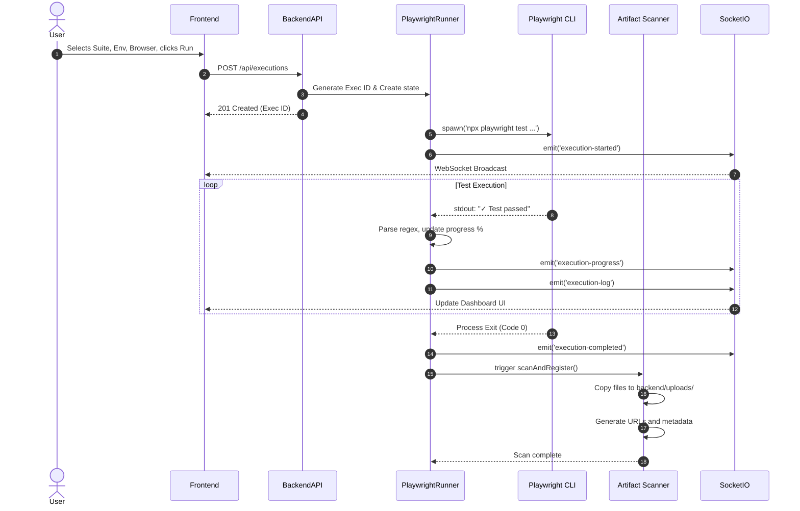
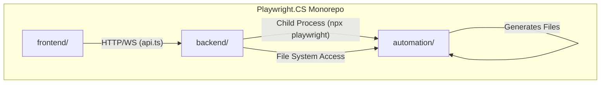

# Playwright Automation Dashboard — Technical Architecture Document

## 1. Project Overview

**What this project is:**
The Playwright Automation Dashboard is a custom, full-stack orchestration and reporting platform for executing end-to-end Playwright tests. It provides a visual interface to trigger test suites, stream real-time execution progress, and view generated artifacts (reports, screenshots, videos, and traces).

**Its purpose:**
To democratize test execution by allowing QA engineers, developers, and product managers to run automation suites against various environments directly from a web browser, without needing to use the CLI or understand the underlying automation framework.

**Primary users:**
- **QA Automation Engineers:** For running suites, debugging failures via traces, and managing test runs.
- **Manual QA & Product Managers:** For verifying features in QA/Staging environments with a click-button interface.
- **Developers:** For quickly running regression suites before deployments.

**High-level architecture:**
The system is built as a Monorepo containing three distinct components:
1. **Frontend:** A React application built with TanStack Start, Vite, and TailwindCSS, served with Server-Side Rendering (SSR) via Nitro.
2. **Backend:** A Node.js Express API that manages test lifecycles, parses CLI output, serves static artifacts, and pushes real-time updates via Socket.IO.
3. **Automation Framework:** A standard Playwright project (Node.js) that actually runs the browser automation tests.

---

## 2. Folder Structure

```
Playwright.CS/
├── frontend/                   # React web application
│   ├── src/                    # Frontend source code
│   │   ├── components/         # Reusable React UI components (Radix/Tailwind)
│   │   ├── hooks/              # Custom React hooks
│   │   ├── lib/                # Utilities, API client (api.ts), types
│   │   ├── routes/             # TanStack Router page definitions
│   │   ├── server.ts           # Nitro SSR entry point
│   │   └── styles.css          # Tailwind global styles
│   ├── vite.config.ts          # Vite & TanStack Start build configuration
│   └── vercel.json             # Vercel deployment configuration
│
├── backend/                    # Express + Socket.IO API server
│   ├── src/                    
│   │   ├── config/             # Centralized environment configuration
│   │   ├── controllers/        # Request handlers (API logic)
│   │   ├── middleware/         # Express middleware (CORS, Helmet, Morgan, Error handling)
│   │   ├── routes/             # Express API route definitions
│   │   ├── services/           # Core business logic (Execution, Playwright Spawning, Artifacts)
│   │   ├── socket/             # Socket.IO connection lifecycle
│   │   ├── utils/              # Helpers (File system, logging, response formatting)
│   │   ├── app.js              # Express application factory
│   │   └── server.js           # HTTP + Socket.IO server bootstrap
│   ├── uploads/                # Dynamic artifact storage (ignored in Git)
│   └── .env                    # Environment variables
│
├── automation/                 # Playwright test framework (NOT deployed)
│   ├── tests/                  # Playwright spec files (*.spec.js)
│   ├── playwright-report/      # Native Playwright HTML reports
│   ├── test-results/           # Native Playwright artifacts (Traces, videos, screenshots)
│   └── playwright.config.js    # Playwright configuration
│
├── Dockerfile                  # Container definition for Playwright + Backend
├── .dockerignore               # Optimized build exclusion list
├── render.yaml                 # Render infrastructure-as-code blueprint
├── docker-compose.yml          # Local container testing orchestration
└── DEPLOYMENT_GUIDE.md         # Production deployment instructions
```

### Important Files & Responsibilities

- **`frontend/src/lib/api.ts`**
  - **Purpose:** Centralized REST client.
  - **Responsibilities:** Wraps `fetch` calls to the backend, handles environment variable resolution for `VITE_API_URL`, and manages localStorage fallbacks.
  - **Imported by:** React hooks and components that need to trigger executions or fetch artifacts.

- **`backend/src/services/playwrightRunner.js`**
  - **Purpose:** The core bridge between the API and the CLI.
  - **Responsibilities:** Spawns the Playwright `npx playwright test` child process, parses `stdout` in real-time to calculate progress, parses `stderr` for warnings, handles process lifecycle, and triggers the `artifactScanner` upon completion.
  - **Imported by:** `execution.controller.js`.

- **`backend/src/services/executionStore.js`**
  - **Purpose:** In-memory state management for active test runs.
  - **Responsibilities:** Maintains a `Map` of currently running executions. Stores logs, progress percentages, and current test names.
  - **Imported by:** `playwrightRunner.js`, `socketService.js`, `artifactScanner.js`, and `execution.controller.js`.

- **`backend/src/services/artifactScanner.js`**
  - **Purpose:** File system scanner.
  - **Responsibilities:** Post-execution, scans `automation/playwright-report` and `automation/test-results`, copies files to `backend/uploads`, generates metadata (URLs, sizes), and registers them in memory for the frontend to consume.
  - **Imported by:** `playwrightRunner.js` (on exit), `artifact.controller.js`.

---

## 3. Complete System Architecture

```mermaid
flowchart TD
    subgraph Frontend [Frontend (React / Vercel)]
        UI[Dashboard UI]
        API_Client[API Client lib/api.ts]
        WS_Client[Socket.IO Client]
        UI --> API_Client
        UI --> WS_Client
    end

    subgraph Backend [Backend (Express / Render Docker)]
        API_Router[Express Routes]
        Controllers[Controllers]
        ExecStore[(In-Memory Store)]
        Runner[Playwright Runner Service]
        Scanner[Artifact Scanner]
        WS_Server[Socket.IO Server]
        Static[Express Static Server]
        
        API_Client -- HTTP POST /api/executions --> API_Router
        API_Router --> Controllers
        Controllers --> Runner
        Runner <--> ExecStore
        Runner --> Scanner
        ExecStore --> WS_Server
    end

    subgraph FileSystem [Persistent Disk]
        Uploads[/app/backend/uploads/]
        Static --> Uploads
        Scanner -- Copies to --> Uploads
    end

    subgraph Automation [Automation (Playwright Container)]
        CLI[npx playwright test]
        Tests[tests/**/*.spec.js]
        Browser((Chromium))
        Outputs[playwright-report & test-results]
        
        Runner -- Spawns child process --> CLI
        CLI --> Tests
        Tests --> Browser
        Browser --> Outputs
        Outputs -- Scanned by --> Scanner
    end

    WS_Server -- WebSocket Events --> WS_Client
```

---

## 4. Frontend Architecture

- **Framework:** React 19 with TanStack Start (a meta-framework for full-stack React).
- **Build Tool:** Vite, configured via `@lovable.dev/vite-tanstack-config`, which implements Nitro for Server-Side Rendering (SSR).
- **Routing:** TanStack Router provides type-safe, file-based routing. Routes are generated automatically.
- **API Layer:** A custom fetch wrapper (`src/lib/api.ts`) that handles base URL resolution and standardizes JSON/text parsing.
- **State Management:** Local component state (React hooks) combined with TanStack Query (assumed/supported by framework) for server state caching.
- **Socket.IO Client:** Listens to `execution-progress`, `execution-log`, and `execution-completed` events to update the UI without HTTP polling.
- **Styling:** TailwindCSS with Radix UI primitives (accessible unstyled components) and Lucide React icons.

---

## 5. Backend Architecture

- **Server:** Node.js Express application (`src/app.js` and `src/server.js`).
- **Middleware:**
  - `cors`: Configured to allow specific origins via `CORS_ORIGIN`.
  - `helmet`: Applies security headers (`crossOriginResourcePolicy: 'cross-origin'` to allow trace viewing).
  - `compression`: Gzips responses.
  - `morgan`: Request logging (`combined` format in prod).
  - `express.static`: Serves artifacts from the `uploads` directory.
- **Architecture Pattern:** Controller-Service pattern.
  - **Routes** map HTTP verbs to Controllers.
  - **Controllers** handle HTTP request/response formatting and validation.
  - **Services** handle business logic (Runner, Scanner, Store).
- **Data Persistence:** Currently entirely in-memory (`executionStore`, `historyService`, artifact arrays). If the server restarts, historical data is lost.
- **File Handling:** `fs-extra` is used extensively for async directory creation, file copying, and size calculations.

---

## 6. Playwright Architecture

**Where it exists:**
Playwright lives in the `automation/` directory. It is executed within the same Docker container as the Express backend.

**Execution Lifecycle:**
1. **Trigger:** Backend `playwrightRunner` determines the command based on user input (e.g., `npx playwright test tests/smoke/home.spec.js --project=chromium --workers=2 --reporter=list`).
2. **Environment Injection:** Backend injects `BASE_URL` (based on QA/Prod selection) and `EXEC_ID` into the child process environment (`buildProcessEnv`).
3. **Execution:** The `child_process.spawn` method executes the command.
4. **Parsing:** The `list` reporter outputs lines like `✓ 1 [chromium] › tests/auth/login.spec.js:12 › user can log in`. The backend parses this via Regex in real-time to increment `passed/failed` counters and calculate progress (`completed / totalPlanned`).
5. **Artifacts:** Playwright generates a native HTML report to `playwright-report/` and traces/videos to `test-results/`.
6. **Completion:** On process exit (code 0 or 1), the runner updates the final status, emits the `execution-completed` Socket event, and triggers the Artifact Scanner to ingest the files into the persistent disk.

---

## 7. Execution Flow (Sequence Diagram)



---

## 8. Socket.IO Flow

- **Server:** Initialized in `backend/src/socket/index.js`, attached to the Express HTTP server. Wraps `socket.io` functionality into `socketService.js`.
- **Client:** Connects from the React frontend, listening for global events.
- **Transports:** Defaults to `websocket` with a `polling` fallback.
- **Events Emitted by Server:**
  - `execution-started`: Metadata of the newly created run.
  - `execution-progress`: Contains `execId`, `progress` (0-100), `passed`, `failed`, `skipped`, and currently running test name.
  - `execution-log`: Contains a timestamp, log level (`info/warn/fail/pass`), and text.
  - `execution-completed`: Final state of the execution.
  - `execution-error`: Fatal process errors (e.g., failed to spawn).

---

## 9. API Documentation

| Endpoint | Method | Purpose | Request Body | Response | Auth | Error Codes |
|---|---|---|---|---|---|---|
| `/api/executions` | `POST` | Start a test execution | `{ suite, environment, browser, mode, workers, specFile? }` | `201 Created` Execution Metadata | None | 400 (Validation) |
| `/api/executions` | `GET` | List all executions | None | `200 OK` `Array<Execution>` | None | 500 |
| `/api/executions/:id` | `GET` | Get execution details | None | `200 OK` `ExecutionDetail` | None | 404 (Not Found) |
| `/api/executions/:id/stop`| `POST` | Kill a running execution | None | `200 OK` `{ ok: true, status }` | None | 404 (Not Found) |
| `/api/executions/:id` | `DELETE`| Remove execution & artifacts | None | `200 OK` `{ ok: true }` | None | 404 (Not Found) |
| `/api/reports` | `GET` | List HTML reports | None | `200 OK` `Array<Report>` | None | 500 |
| `/api/traces` | `GET` | List Trace ZIP files | None | `200 OK` `Array<Trace>` | None | 500 |
| `/api/videos` | `GET` | List recorded videos | None | `200 OK` `Array<Video>` | None | 500 |
| `/api/specs` | `GET` | Dynamic spec file tree | None | `200 OK` `{ folders, totalFiles }`| None | 500 |
| `/api/settings` | `GET` | Get dashboard settings | None | `200 OK` `BackendSettings` | None | 500 |
| `/api/settings` | `PUT` | Update dashboard settings | `Partial<BackendSettings>` | `200 OK` `{ ok: true }` | None | 500 |

---

## 10. Environment Variables

| Variable | Development Example | Production Example | Purpose |
|---|---|---|---|
| **Frontend** | | | |
| `VITE_API_URL` | `http://localhost:4000` | `https://api.myapp.com` | Tells the frontend API Client where the backend is located. |
| **Backend** | | | |
| `NODE_ENV` | `development` | `production` | Determines logging format, error stack traces, and Express caching. |
| `PORT` | `4000` | N/A (Injected by Render) | Port the Express server listens on. |
| `HOST` | `0.0.0.0` | `0.0.0.0` | Bind address. |
| `CORS_ORIGIN` | `http://localhost:5173` | `https://app.myapp.com` | Secures the API by restricting access to the deployed frontend domain. |
| `LOG_LEVEL` | `debug` | `info` | Console log verbosity. |
| `UPLOADS_DIR` | `uploads` | `uploads` | Root path for storing generated artifacts. |
| `PLAYWRIGHT_PROJECT_PATH`| `../automation` | `../automation` | Path to the Playwright root relative to the Docker WORKDIR `/app/backend`. |

---

## 11. Dependency Graph



---

## 12. Deployment Requirements

To successfully run this full system in production, the infrastructure requires:
- **Playwright Dependencies:** The Backend container MUST be able to install and run browsers. This requires specific OS-level dependencies (Debian/Ubuntu packages like `libgbm1`, `libnss3`, `libasound2`, fonts).
- **Compute (Backend):** Running headless browsers is expensive. Minimum 2GB RAM required; 4GB+ recommended for parallel workers.
- **Networking:** Support for long-lived WebSocket connections (WSS) and HTTP/2.
- **Storage (Backend):** Must allow writing to the file system. Traces and videos can be hundreds of megabytes. Persistent storage is absolutely required.

---

## 13. Current Deployment Strategy

The project is configured for a **Split Deployment Strategy**:

1. **Frontend → Vercel:**
   - **How:** Vercel points to the `frontend` root directory.
   - **Why:** Vercel is highly optimized for Vite and TanStack Start, providing edge caching, SSR support via Nitro, and seamless global CDN delivery.

2. **Backend → Render (Docker + Persistent Disk):**
   - **How:** A `render.yaml` blueprint deploys the repository using a custom `Dockerfile` based on `mcr.microsoft.com/playwright`.
   - **Capabilities:** Runs a fully containerized OS with pre-installed Chromium, WebKit, and Firefox graphics dependencies. A Persistent Disk is attached and mounted to `/app/backend/uploads` to ensure all historical reports and traces survive deployments and restarts safely.

---

## 14. Production Architecture

### Implemented Architecture: Dockerized Backend with Persistent Volume

```mermaid
flowchart TD
    Vercel[Frontend on Vercel]
    
    subgraph Cloud VPS (Render / Railway / DigitalOcean)
        subgraph Docker Container [mcr.microsoft.com/playwright:v1.61.1-jammy]
            Express[Express Backend API]
            Runners[Playwright Child Processes]
            Express -- spawns --> Runners
        end
        Volume[(Persistent Block Storage)]
    end
    
    Vercel -- HTTPS --> Express
    Vercel -- WSS --> Express
    Express -- Reads/Writes --> Volume
    Runners -- Writes --> Volume
```

**Why this architecture?**
1. **Playwright OS Requirements:** By using Microsoft's official Playwright Docker image as the base image for the backend deployment, all browser dependencies are inherently solved.
2. **Persistent Storage:** Deploying to ephemeral containers means losing all historical test runs and artifacts on every restart. The attached Persistent Volume (Disk) solves this entirely.

**Future Optimizations:**
- Move `executionStore` and `historyService` from an in-memory `Map` to a lightweight SQLite database or Redis to survive application restarts and scale horizontally.
- Implement a task queuing mechanism (e.g. BullMQ) to rate-limit concurrent Playwright executions, protecting the container from Out-of-Memory (OOM) crashes.

---

## 15. CI/CD

**Current Strategy:**
- **Auto-deployment:** Handled natively by Vercel and Render. Pushing to the `master` branch on GitHub automatically triggers build and deployment pipelines on both platforms.

**Recommended Production Pipeline (GitHub Actions):**
1. **PR Created:**
   - Action: Run Frontend Linting (`npm run lint`).
   - Action: Run Automation Tests (`npx playwright test`) headlessly against a staging environment.
2. **Merge to Master:**
   - Action: Deploy Frontend (Vercel).
   - Action: Build Docker Image, Deploy Backend (Render).

---

## 16. Known Limitations

1. **Ephemeral State:** Currently, history and live execution state are stored in memory (`[]` and `Map`). Restarting the Node server wipes active/historical execution data (though the actual artifacts remain safe on the disk).
2. **Vertical Scaling Only:** Because Socket.IO state and execution processes run locally on the backend server, you cannot scale the backend horizontally (multiple instances) without introducing Redis for Socket.IO and a distributed task queue (like BullMQ) for Playwright executions.
3. **Memory Exhaustion:** Users can trigger an unlimited number of parallel executions. Running 10 suites simultaneously with 4 workers each will crash a standard cloud server due to Out-Of-Memory (OOM) errors. Rate limiting and queueing are required in the future.

---

## 17. Final Summary

**Current State:**
The project is a beautifully architected, decoupled system. The frontend provides a modern React interface, while the Express backend acts as an orchestrator, spawning Playwright child processes, parsing standard output for real-time progress via WebSockets, and serving HTML reports and traces. 

**Deployment Model:**
A split monorepo deployment is currently implemented. The frontend is deployed to Vercel (ideal for TanStack Start). The backend is fully containerized inside a Playwright Docker image and deployed to Render with an attached Persistent Disk. They communicate securely over HTTPS/WSS via environment variables and CORS configurations.

**Production Reality:**
The backend infrastructure is now fully production-ready for execution. The Docker container perfectly hosts both the Express API and the Playwright binaries, completely solving OS-level browser dependency issues, while the persistent disk securely stores all generated artifacts.
