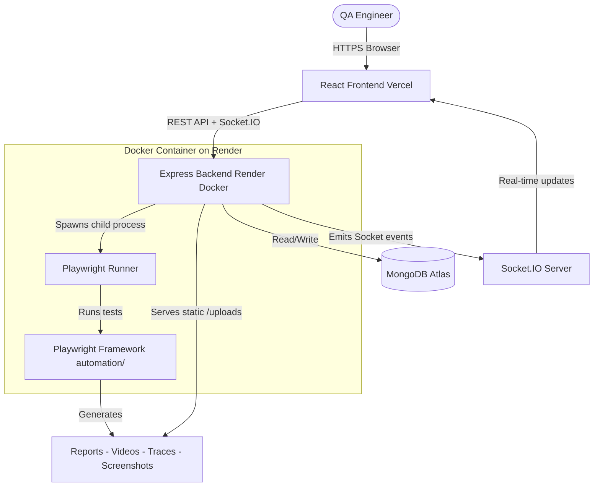
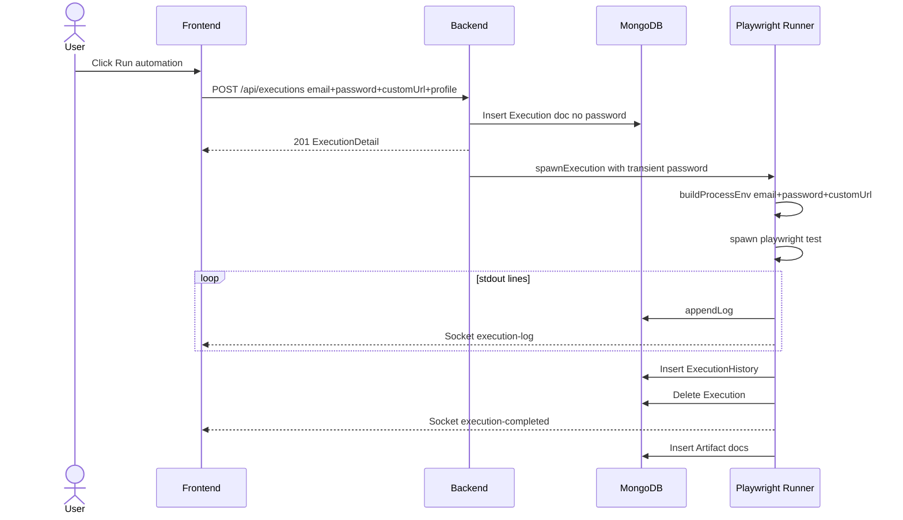

# System Architecture — QA Automation Console

> **Single Source of Truth.** This document is the canonical reference for the entire platform. Every architectural change must be logged in the [Architecture Change Log](#architecture-change-log) section below.

---

## Table of Contents

1. [Complete System Overview](#complete-system-overview)
2. [Frontend Architecture](#frontend-architecture)
3. [Backend Architecture](#backend-architecture)
4. [Playwright Framework](#playwright-framework)
5. [MongoDB Collections](#mongodb-collections)
6. [Socket.IO](#socketio)
7. [Execution Flow](#execution-flow)
8. [Report Generation](#report-generation)
9. [Artifact Flow](#artifact-flow)
10. [Folder Structure](#folder-structure)
11. [API Flow](#api-flow)
12. [Authentication Flow](#authentication-flow)
13. [Configuration Flow](#configuration-flow)
14. [Execution Profiles](#execution-profiles)
15. [Runtime Credentials](#runtime-credentials)
16. [Custom URL Support](#custom-url-support)
17. [Deployment Flow](#deployment-flow)
18. [Environment Variables](#environment-variables)
19. [Security](#security)
20. [Performance](#performance)
21. [Future Roadmap](#future-roadmap)
22. [Architecture Change Log](#architecture-change-log)

---

## Complete System Overview

The platform is a full-stack, real-time QA Automation Console. It wraps the Playwright test runner behind a web dashboard that provides:

- **Visual test execution** — configure and trigger Playwright test runs from a browser UI
- **Live progress streaming** — Socket.IO pushes real-time stdout to the dashboard
- **Artifact management** — reports, screenshots, videos, and traces stored and served from the backend
- **Execution history** — every run is archived to MongoDB with full metadata
- **Execution Profiles** — reusable run configurations (no passwords stored)
- **Runtime Credentials** — provide email/password at execution time (never persisted)
- **Custom URL** — override the target URL without editing environment files



---

## Frontend Architecture

**Stack:** React + TanStack Start + TanStack Router + Vite + Tailwind CSS v4 + shadcn-ui

### Route Map

| Route | File | Purpose |
|---|---|---|
| `/` | `index.tsx` | Dashboard overview / metrics |
| `/run` | `run.tsx` | Configure and dispatch executions |
| `/profiles` | `profiles.tsx` | Manage execution profiles |
| `/history` | `history.tsx` | Browse past executions |
| `/reports` | `reports.tsx` | View HTML reports |
| `/screenshots` | `screenshots.tsx` | Browse test screenshots |
| `/videos` | `videos.tsx` | Browse test videos |
| `/traces` | `traces.tsx` | View Playwright traces |
| `/logs` | `logs.tsx` | View execution logs |
| `/settings` | `settings.tsx` | Configure environments and notifications |

---

## Backend Architecture

**Stack:** Node.js + Express + Mongoose + Socket.IO + nanoid

### Layer Responsibilities

| Layer | Location | Responsibility |
|---|---|---|
| Routes | `src/routes/*.js` | HTTP verb to controller mapping |
| Controllers | `src/controllers/*.js` | Validate input, delegate to services |
| Services | `src/services/*.js` | Business logic |
| Models | `src/models/*.js` | MongoDB schemas |
| Utils | `src/utils/*.js` | Shared helpers |
| Middleware | `src/middleware/*.js` | CORS, security, validation, logging |

---

## Playwright Framework

All configuration flows from environment variables injected by the backend. The framework never reads process.env directly — it reads via `config/test.config.js`.

### Key ENV vars injected per run

| Variable | Source | Purpose |
|---|---|---|
| `BASE_URL` | environment mapping OR runtime `customUrl` | Target application URL |
| `TEST_EMAIL` | runtime `email` OR `.env` fallback | Login credentials |
| `TEST_PASSWORD` | runtime `password` OR `.env` fallback | Login credentials (never stored) |
| `EXEC_ID` | generated | Unique execution identifier |

---

## MongoDB Collections

### `executions`

Stores live executions currently in progress.

| Field | Type | Notes |
|---|---|---|
| `id` | String | Unique execution ID |
| `suite` | String | Test folder name |
| `environment` | String | Target environment name |
| `browser` | String | Chrome / Firefox / Edge |
| `mode` | String | Headless / Headed |
| `workers` | Number | Parallel worker count |
| `email` | String | Operator email (traceability only) |
| `profile` | String | Profile name used |
| `customUrl` | String | Custom BASE_URL if used |
| `status` | String | running / passed / failed / aborted |
| `logs` | Array | Log lines |

> **Security:** Passwords are NEVER stored in any execution document.

### `execution_histories`

Mirror of `executions` for completed runs. Archived permanently.

### `artifacts`

Stores metadata about generated test artifacts (reports, screenshots, videos, traces).

### `execution_profiles` (NEW)

| Field | Type | Notes |
|---|---|---|
| `name` | String | Unique profile name |
| `email` | String | Default operator email (NO password) |
| `defaultEnvironment` | String | Environment name |
| `defaultBrowser` | String | Chrome / Firefox / Edge |
| `defaultWorkers` | Number | 1–16 |
| `defaultMode` | String | Headless / Headed |
| `defaultFolder` | String | Test folder (suite) |
| `defaultSpec` | String | Spec file path (optional) |
| `description` | String | Human-readable description |

> **Security:** No password field exists in this schema. By design.

---

## Socket.IO

| Event | Direction | Payload |
|---|---|---|
| `execution-started` | Server to Client | ExecutionDetail |
| `execution-log` | Server to Client | `{execId, ts, level, text}` |
| `execution-progress` | Server to Client | `{execId, progress, passed, ...}` |
| `execution-completed` | Server to Client | ExecutionDetail |
| `execution-error` | Server to Client | `{execId, error}` |

---

## Execution Flow



---

## Artifact Flow

Playwright outputs to `automation/playwright-report/exec_id/` and `automation/test-results/exec_id/`. The `artifactScanner` service picks these up after execution and registers them in MongoDB as `Artifact` documents with relative URL paths. Express serves `/uploads/**` statically.

---

## Folder Structure

```
c:\CS\Playwright.CS
├── automation/                   # Playwright framework
├── backend/                      # Express API + Socket.IO
│   ├── src/
│   │   ├── controllers/          # HTTP request handlers
│   │   ├── middleware/           # CORS, security, validation
│   │   ├── models/               # Mongoose schemas
│   │   ├── routes/               # Express routers
│   │   ├── services/             # Business logic
│   │   └── utils/                # Shared utilities
│   └── uploads/                  # Generated artifacts
├── frontend/                     # React dashboard
│   └── src/
│       ├── components/           # UI components
│       ├── lib/                  # API client, execution store, socket
│       └── routes/               # TanStack Router pages
├── docs/                         # Architecture documentation
├── Dockerfile                    # Backend + Playwright container
└── render.yaml                   # Render deployment config
```

---

## API Flow

| Endpoint | Method | Purpose |
|---|---|---|
| `/api/executions` | GET | List all executions |
| `/api/executions` | POST | Start new execution |
| `/api/executions/:id` | GET | Get execution detail |
| `/api/executions/:id/stop` | POST | Stop running execution |
| `/api/executions/:id` | DELETE | Delete execution |
| `/api/profiles` | GET | List execution profiles |
| `/api/profiles` | POST | Create profile |
| `/api/profiles/:id` | GET | Get profile |
| `/api/profiles/:id` | PUT | Update profile |
| `/api/profiles/:id` | DELETE | Delete profile |
| `/api/settings` | GET | Get settings |
| `/api/settings` | PUT | Update settings |
| `/api/specs` | GET | Discover spec files |
| `/api/reports` | GET | List reports |
| `/api/screenshots` | GET | List screenshots |
| `/api/videos` | GET | List videos |
| `/api/traces` | GET | List traces |

---

## Authentication Flow

> **Current State:** No user authentication. Network-level access control assumed.

Test credentials (for the app under test) flow as follows:

1. **Runtime credentials** — user enters email/password in Run page; password sent once, injected into child process env, then discarded
2. **`.env` fallback** — `TEST_EMAIL`/`TEST_PASSWORD` in `backend/.env` used when no runtime credentials provided

---

## Configuration Flow

```
backend/.env
  → dotenv → config/index.js
  → Services/Controllers

POST /api/executions payload (email, customUrl, profile)
  → execution.controller
  → createExecution (stores email, customUrl, profile — NOT password)
  → playwrightRunner (receives transient password)
  → buildProcessEnv (email, password, customUrl resolve BASE_URL + credentials)
  → Child process ENV vars
  → automation/config/test.config.js
  → playwright.config.js
```

---

## Execution Profiles

Profiles are stored in `execution_profiles` collection. When selected on the Run page, they auto-fill environment, browser, workers, folder, spec, and email. Password is always entered manually at run time and never stored in a profile.

---

## Runtime Credentials

```
User enters email + password in Run page
  POST /api/executions { email, password, ... }
  Controller stores email/profile/customUrl in Execution doc
  Controller does NOT store password
  Controller attaches password as _runtimePassword in memory only
  Runner passes password to buildProcessEnv()
  Password exists only in child process env object
  Child process exits → reference garbage collected
  MongoDB contains: email, profile, customUrl (not password)
```

---

## Custom URL Support

When "Use Custom URL" is enabled:
1. User enters a URL instead of selecting an environment
2. URL is validated client-side
3. `customUrl` sent in POST body
4. `environmentService.buildProcessEnv()` uses `customUrl` as `BASE_URL` instead of environment mapping
5. `customUrl` stored in Execution for audit trail

---

## Deployment Flow

See `docs/DEPLOYMENT_GUIDE.md` for full instructions.

- **Frontend:** Vercel (auto-deploy from GitHub)
- **Backend:** Render (Docker container, auto-deploy from GitHub)
- **Database:** MongoDB Atlas (shared)

---

## Environment Variables

### Backend

| Variable | Purpose |
|---|---|
| `PORT` | HTTP server port (default: 4000) |
| `MONGODB_URI` | MongoDB connection string |
| `CORS_ORIGIN` | Allowed frontend origins |
| `TEST_EMAIL` | Fallback test email |
| `TEST_PASSWORD` | Fallback test password (never logged) |
| `LOG_LEVEL` | Logging verbosity |
| `PLAYWRIGHT_HEADED` | Allow headed execution |

### Frontend

| Variable | Purpose |
|---|---|
| `VITE_API_URL` | Backend API URL |

---

## Security

| Concern | Approach |
|---|---|
| Passwords | Never stored in DB, logs, or Socket events |
| API Keys | In `.env`, never in source code |
| CORS | Strict origin allowlist |
| Helmet | Security headers via middleware |
| Input validation | Validation middleware on all execution payloads |
| Artifact paths | Normalised to prevent directory traversal |

---

## Performance

| Area | Current Approach |
|---|---|
| Log cap | 2000 lines in memory, 1500 in MongoDB |
| MongoDB indexes | `status+startedAt`, `startedAt`, `execId+type` |
| Static files | 7-day cache headers |
| Real-time | Socket.IO room isolation per execution |

---

## Future Roadmap

- [ ] User authentication (JWT / OAuth)
- [ ] Scheduled execution (cron-based)
- [ ] CI/CD webhooks (GitHub Actions, GitLab CI, Jenkins)
- [ ] Multi-project / multi-team isolation
- [ ] Slack / Email / Teams notifications
- [ ] AI-powered flaky test detection and failure analysis
- [ ] Execution queue and concurrency limits
- [ ] Cross-run report diff
- [ ] Dashboard metrics (success rate trends, flakiness scores)

---

# Architecture Change Log

> **Rule:** Every code change must be appended here. Never overwrite. Always append.

---

## 2026-07-18 — v1.0.0 — Initial Codebase Cleanup

**Updated By:** Antigravity (AI Assistant)
**Module:** Frontend, Backend, Automation, Documentation

**Files Changed:**
- Deleted 31 unused shadcn-ui components in `frontend/src/components/ui/`
- Deleted leftover `backend/test-phase2.js` script
- Removed unused frontend dependencies (27 Radix/UI packages)
- Removed `multer` from backend
- Removed `@types/node` from automation devDependencies
- Created `PROJECT_ARCHITECTURE.md`

**Previous Behaviour:** Codebase had leftover prototype files and unused UI components
**New Behaviour:** Leaner project with dead code removed
**Breaking Changes:** None
**Migration Required:** No

---

## 2026-07-18 — v1.1.0 — Enterprise Platform Enhancements

**Updated By:** Antigravity (AI Assistant)
**Module:** Backend (Models, Services, Controllers, Routes), Frontend (Routes, Components, API), Documentation

**Files Changed:**

_Backend — Modified:_
- `backend/src/models/Execution.js` — Added `email`, `profile`, `customUrl` fields
- `backend/src/models/ExecutionHistory.js` — Added `email`, `profile`, `customUrl` fields
- `backend/src/services/environmentService.js` — `buildProcessEnv` now accepts runtime `email`, `password`, `customUrl`
- `backend/src/services/playwrightRunner.js` — Passes runtime credentials to `buildProcessEnv`
- `backend/src/services/executionStore.js` — `toPlain` now includes `email`, `profile`, `customUrl`
- `backend/src/controllers/execution.controller.js` — Extracts runtime fields; handles transient password
- `backend/src/utils/executionHelper.js` — `createExecution` accepts `email`, `profile`, `customUrl`
- `backend/src/app.js` — Registered `/api/profiles` route

_Backend — New:_
- `backend/src/models/ExecutionProfile.js` — New MongoDB model for execution profiles
- `backend/src/controllers/profile.controller.js` — Full CRUD for profiles
- `backend/src/routes/profile.routes.js` — Route wiring for `/api/profiles`

_Frontend — Modified:_
- `frontend/src/lib/api.ts` — Added `ExecutionProfile` types, extended `StartPayload`, added profile API methods
- `frontend/src/routes/run.tsx` — Added Execution Summary, Profile selector, Custom URL toggle, Runtime Credentials inputs
- `frontend/src/components/app-shell.tsx` — Added "Execution Profiles" nav item

_Frontend — New:_
- `frontend/src/routes/profiles.tsx` — Full profiles management page (CRUD UI)

_Documentation — New:_
- `docs/SYSTEM_ARCHITECTURE.md` — Master architecture doc + change log
- `docs/API_DOCUMENTATION.md`
- `docs/DATABASE_SCHEMA.md`
- `docs/DEPLOYMENT_GUIDE.md`
- `docs/CLEANUP_REPORT.md`

**Previous Behaviour:**
- Credentials were read only from `backend/.env`
- No execution profiles existed
- Run page had no custom URL support
- No pre-run summary before executing

**New Behaviour:**
- Runtime email/password can be provided at execution time and are never stored
- Execution profiles allow saving reusable configurations (no passwords)
- Custom URL toggle lets users override the environment URL without editing files
- Execution Summary panel shows exactly what will run before clicking Run

**Impact:**
- `POST /api/executions` now accepts additional optional fields: `email`, `password`, `customUrl`, `profile`
- New MongoDB collection: `execution_profiles`
- New API: `GET/POST/PUT/DELETE /api/profiles`

**Breaking Changes:** None — all new fields are optional with fallback behavior
**Migration Required:** No — existing executions continue to work unchanged
**Validation:** Existing tests, API calls, and execution flows are fully backward compatible
